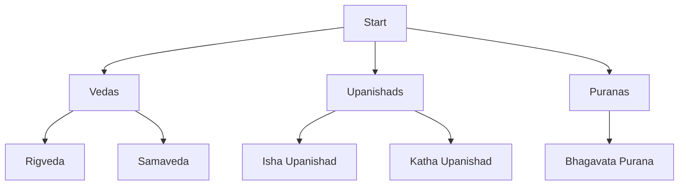

---
tags:
  - DailyNotes
  - GenAI
aliases:
  - VEDAS
  - PURANS
  - UPANISHADS
Category: GenAI
Related: GeminiPrompts
Source:
---
# 2025-04-26-Saturday

---
Date: 2025/04-April/2025-04-26-Saturday
Time: 22:40
Related: [[2025-04-19-Saturday]]
Category: #Research 
Tags: #GenAI  

---
... contd. from [[2025-04-18-Friday]]
#ideas from [[2025-04-19-Saturday]]
# Question(s) 

Thank you for the results.
I am good at bash, sql, python programming. I also want to explore C++, GoLang and Rust. I also want to utilize sqllite3, postgresql, Mongo DB as well. 

But today, I want to start study about Vedas, Puranas, Upanishads but would like also include programming with the study of these ancient texts.
I have some ideas for projects. Can you suggest on how to leverage my programming skills and desire to learn new languages and databases can be used in these projects:


1. Get the comprehensive list of Vedas, purans, upanishads, epic poems, samhitas, etc. 
2. Teach me how to extract data/text/pdfs from the related websites, using the programming tools
3. Classify these lists in a DB based on 
	1. language - english, hindi, sanskrit
	2. format - pdf, text, html
	3. category - vedas, purans, upanishads, poems, samhitas, etc.
	4. philosophical concepts - soul, ...
	5. theme - soul, war, math, duty, medicine, art, etc.
4. Create a flowchart to study these text. 
	- Follow the roadmap examples from [GitHub Roadmaps Repositories](https://github.com/liuchong/awesome-roadmaps)
5. Create a graph database connection between "the philosophical concepts of vedas, purans, upanishads, epic poems, samhitas, etc." with "science, physics, mathematics, universe and quantum mechanics".


# Desired Result(s) 


# Content 


## Phase II responses


# Gemini

That's an ambitious and exciting set of projects! Combining your programming skills with the study of ancient Indian texts in this way will be a truly unique and rewarding endeavor. Here's how you can leverage your existing skills and your desire to learn new ones for each of your project ideas:

**1. Get the comprehensive list of Vedas, Puranas, Upanishads, epic poems, samhitas, etc.**

- **Leveraging Existing Skills:**
    - **Python:** You can use Python for web scraping to gather this information from various online resources. Libraries like `requests` to fetch web pages and `Beautiful Soup` or `Scrapy` to parse the HTML content can be very effective.
    - **Bash:** Once you have a list (perhaps in a text file or CSV), you can use bash scripts for basic processing, like filtering or formatting the list.
- **Learning New Skills:**
    - **GoLang and Rust:** While Python is well-suited for web scraping, GoLang or Rust could be used for building more performant and concurrent web scrapers if you're dealing with a very large number of websites.
    - **SQL:** You'll need SQL later to store and query this list, so your existing SQL skills will be crucial.
- **How to Approach:**
    - Identify key websites that provide lists of these texts. Good starting points include:
        - Vedic Heritage Portal ([https://vedicheritage.gov.in/](https://vedicheritage.gov.in/)) - Explore the site map and categories.1
        - Sanskrit Documents ([https://sanskritdocuments.org/](https://sanskritdocuments.org/)) - Browse through the categories and main texts.2
        - Wikipedia's "List of Hindu texts" ([https://en.wikipedia.org/wiki/List_of_Hindu_texts](https://en.wikipedia.org/wiki/List_of_Hindu_texts)).
        - Temple Purohit's list of Upanishads ([https://www.templepurohit.com/upanishads-details-list-108-upanishads-classifications/](https://www.templepurohit.com/upanishads-details-list-108-upanishads-classifications/)).
        - Vyasa Online's list of Puranas ([https://www.vyasaonline.com/maha-puranas/](https://www.vyasaonline.com/maha-puranas/)).
    - Write Python scripts using `requests` to fetch the HTML content of these pages.
    - Use `Beautiful Soup` to parse the HTML and extract the relevant lists of texts. Look for specific HTML tags (like `<ul>`, `<ol>`, `<table>`, `<a>`, `<li>`) that contain the names of the texts.
    - You might need to handle pagination if the lists span multiple pages.
    - Consider saving the initial lists to CSV files.

**2. Teach me how to extract data/text/pdfs from the related websites, using the programming tools**

- **Leveraging Existing Skills:**
    - **Python:** Python is excellent for this. You can use libraries like `requests` to download files (including PDFs) and fetch text content from HTML pages. For PDFs, libraries like `PyPDF2` or `pdfminer.six` can extract text.
    - **Bash:** You can use `wget` or `curl` in bash scripts to download files from URLs directly. For simple text extraction from HTML, you could use command-line tools like `grep`, `sed`, or `awk`, but Python is generally more robust for complex HTML structures.
- **Learning New Skills:**
    - **GoLang and Rust:** These languages also have libraries for making HTTP requests and handling file downloads. For example, Rust has the `reqwest` crate, and Go has the `net/http` package. Exploring these could be a good exercise in learning the languages.
- **How to Approach:**
    - **For HTML Text:**
        - Use Python's `requests` to get the page content.
        - Use `Beautiful Soup` to parse the HTML.
        - Identify the HTML elements containing the main text content (e.g., `<p>`, `<div>` with specific classes or IDs).
        - Use methods like `.get_text()` to extract the text.
    - **For PDFs:**
        - Use Python's `requests` to download the PDF file if it's linked on a webpage.
        - Use `PyPDF2` to open the PDF and extract text page by page.
        - For more complex PDFs (e.g., scanned documents), you might need OCR (Optical Character Recognition). Python libraries like `pytesseract` (with Tesseract OCR engine installed) can help with this.
    - **Using Bash:**
        - `wget <URL>` will download the file at the given URL. Use options like `-O` to specify the output filename.
        - `curl -O <URL>` also downloads the file.
        - To get the text content of a simple HTML page, you could try `wget -qO- <URL> | sed -e 's/<[^>]*>//g'` (though this won't work well for modern, JavaScript-heavy websites).

**3. Classify these lists in a DB based on the specified criteria**

- **Leveraging Existing Skills:**
    - **SQL:** Your proficiency in SQL is directly applicable here. You can design a database schema and use SQL to insert and manage the classified data.
    - **Python:** You can use Python to process the lists obtained in step 1 and then connect to and interact with various database systems using libraries like `sqlite3` for SQLite, `psycopg2` for PostgreSQL, and `pymongo` for MongoDB.
- **Learning New Skills:**
    - **SQLite3, PostgreSQL, MongoDB:** You mentioned wanting to use these. You can start with SQLite as it's file-based and easy to set up with Python. Then, you can explore PostgreSQL and MongoDB for more advanced features and different data models (relational vs. NoSQL).
- **How to Approach:**
    - **Database Design:**
        - Create tables to store the information. A central table for texts could have columns like `title`, `language`, `format`, `category`, `url`.
        - You might need separate tables for `philosophical_concepts` and `themes` with many-to-many relationships to the `texts` table.
        - Consider the relationships between different categories of texts (e.g., Upanishads are part of the Vedas).
        - Look at the database design ideas mentioned in the research report.3
    - **Data Classification:**
        - You'll likely need to manually classify some of the texts initially, especially for philosophical concepts and themes.
        - For language and format, you might be able to infer this from the website or file extension.
        - You can write Python scripts to read your lists, prompt for classification (if needed), and then insert the data into your chosen database.
    - **Database Interaction:**
        - Use Python's database connectors to establish connections.
        - Execute SQL `INSERT` statements to add data.
        - For MongoDB, use the appropriate methods to insert documents.

**4. Create a flowchart to study these text.**

- **Leveraging Existing Skills:**
    - Your programming background will help you think logically about the flow of study.
- **Learning New Skills:**
    - Explore the roadmaps in the([https://github.com/liuchong/awesome-roadmaps](https://github.com/liuchong/awesome-roadmaps)) for inspiration on structure and content. Look for roadmaps related to learning programming languages, frameworks, or even broader topics like becoming a software architect.
- **How to Approach:**
    - **Identify a Starting Point:** Where should someone begin their study (e.g., a specific Veda, a set of principal Upanishads)?
    - **Define Logical Progression:** What should be studied next? Consider categories, complexity, or thematic connections. For example, you might start with an introduction to the four Vedas, then delve into the principal Upanishads associated with each Veda, and then explore the Puranas.
    - **Incorporate Programming:** Think about where your programming projects fit into this study flow. For example, after studying a set of texts, you might have a step to "Perform textual analysis using Python."
    - **Visualize the Flowchart:** You can use various tools to create the flowchart:
        - **Online tools:** draw.io, Lucidchart.
        - **Desktop software:** Microsoft Visio, LibreOffice Draw.
        - **Markdown with extensions:** Some Markdown editors support flowchart syntax.
    - **Iterate and Refine:** Your study plan might evolve as you learn more.

**5. Create a graph database connection between "the philosophical concepts of vedas, purans, upanishads, epic poems, samhitas, etc." with "science, physics, mathematics, universe and quantum mechanics".**

- **Leveraging Existing Skills:**
    - Your understanding of databases will be helpful in grasping the concept of a graph database.
    - Python can be used to extract philosophical concepts and potential links to scientific topics from the texts.
- **Learning New Skills:**
    - **Graph Databases:** Explore graph database technologies like Neo4j or OrientDB. These databases are designed to model relationships between entities effectively.
    - **NLP Techniques:** You might need to learn more advanced Natural Language Processing (NLP) techniques to automatically identify and extract philosophical concepts and their relationships to scientific domains. Libraries like `spaCy` or `NLTK` can be used for tasks like named entity recognition and relationship extraction.4
- **How to Approach:**
    - **Concept Extraction:**
        - Read the texts and manually identify key philosophical concepts (e.g., Atman, Brahman, Karma, Dharma).
        - Look for mentions of topics related to science, physics, mathematics, the universe, and quantum mechanics (though direct mentions of "quantum mechanics" might be rare in ancient texts, look for related ideas about the nature of reality, the cosmos, etc.).5
        - You could try using NLP techniques like keyword extraction or topic modeling to help identify these concepts automatically.9
    - **Relationship Identification:**
        - Analyze the context in which these concepts appear to understand the relationships between them. For example, how is the concept of "Atman" related to the "universe" in the Upanishads?
        - You might need to define specific types of relationships (e.g., "is_a", "related_to", "explains").
    - **Graph Database Implementation:**
        - Choose a graph database (Neo4j is a popular choice with a Python driver called `neo4j-driver`).
        - Define nodes for your philosophical concepts and scientific topics.
        - Create edges between these nodes to represent the relationships you've identified. You can add properties to the nodes and edges (e.g., the text where the relationship is mentioned).
        - Use the graph database's query language (like Cypher for Neo4j) to explore the connections.

**General Tips:**

- **Start Small:** Don't try to tackle all these projects at once. Begin with one that interests you the most and build from there.
- **Focus on Learning:** Your primary goal is to study the ancient texts. Let your programming skills enhance this process.
- **Iterate:** Your approach and understanding will evolve as you learn. Be prepared to revisit and refine your projects.
- **Utilize Existing Resources:** Explore the links and projects mentioned in the research report for inspiration and potential tools you can use.13 Look for existing Sanskrit NLP libraries in Python.15
- **Consider Digital Humanities Projects:** Look at resources and projects in the field of Digital Humanities for Sanskrit for methodologies and tools.32

By combining your technical skills with a genuine interest in these ancient texts, you're embarking on a truly unique and potentially groundbreaking journey of discovery! Good luck!
#  Copilot

Your project ideas are fantastic! They beautifully combine your programming expertise with your interest in ancient texts. Let me break down how you can approach each project while leveraging your skills and exploring new languages and databases:

---

### 1. **Get the Comprehensive List**
   - **Approach**: Use web scraping tools like Python's `BeautifulSoup` or `Scrapy` to extract lists of Vedas, Puranas, Upanishads, etc., from reliable sources.
   - **Database**: Store the data in SQLite3 for simplicity or PostgreSQL for scalability.
   - **Learning Opportunity**: If you're exploring GoLang or Rust, you can use libraries like `Colly` (GoLang) or `reqwest` (Rust) for web scraping.

---

### 2. **Extract Data/Text/PDFs**
   - **Approach**: Automate the download of PDFs and text files using Python's `requests` library or Bash scripting with `wget`/`curl`.
   - **Text Processing**: Use Python libraries like `PyPDF2` or `pdfminer.six` to extract text from PDFs.
   - **Learning Opportunity**: Experiment with GoLang's `pdfcpu` or Rust's `lopdf` for PDF handling.

---

### 3. **Classify Lists in a Database**
   - **Approach**:
     - Design a schema with tables for language, format, category, philosophical concepts, and themes.
     - Use SQL for relational databases like PostgreSQL or explore MongoDB for a NoSQL approach.
   - **Automation**: Write Python scripts to populate the database and classify entries based on metadata.
   - **Learning Opportunity**: Practice advanced SQL queries and explore MongoDB's aggregation framework.

---

### 4. **Create a Flowchart for Study**
   - **Approach**:
     - Use Python's `Graphviz` library or tools like `Mermaid.js` to generate flowcharts programmatically.
     - Follow the roadmap examples from GitHub repositories for inspiration.
   - **Learning Opportunity**: If you're exploring C++, use libraries like `Boost.Graph` for graph-based visualizations.

---

### 5. **Graph Database for Philosophical Connections**
   - **Approach**:
     - Use Neo4j or ArangoDB to create a graph database connecting philosophical concepts with scientific ideas.
     - Write queries in Cypher (Neo4j) to explore relationships.
   - **Learning Opportunity**: Experiment with Rust's `graphlib` or GoLang's `gonum` for graph-based computations.

---

### Additional Tips:
- **Version Control**: Use Git to manage your projects and collaborate with others.
- **Documentation**: Maintain clear documentation for each project to make it accessible to others.
- **Community**: Share your progress on platforms like GitHub or forums to get feedback and connect with like-minded individuals.

---

These projects not only deepen your understanding of the texts but also allow you to master new programming languages and databases. Which one are you most excited to start with? 🚀
#  Meta


Let's break down each project idea and explore how you can leverage your programming skills, databases, and desire to learn new languages:
1. Comprehensive List of Vedas, Puranas, Upanishads, etc.
Use Python's requests and BeautifulSoup libraries to scrape lists of texts from websites like Wikipedia, Sacred Texts, or other online repositories.
Store the list in a database like PostgreSQL or SQLite3, with columns for text name, category, language, and format.
2. Extracting Data/Text/PDFs from Websites
Use Python's requests and BeautifulSoup libraries to extract text data from websites.
For PDFs, use libraries like PyPDF2 or pdfminer to extract text.
Store the extracted data in your database.
Example code for extracting text from a website:
Python
import requests
from bs4 import BeautifulSoup

url = "https://www.example.com/vedic-texts"
response = requests.get(url)
soup = BeautifulSoup(response.content, 'html.parser')

## Extract text from the webpage
text = soup.get_text()
3. Classifying Texts in a DB
Design a database schema with tables for texts, categories, languages, formats, philosophical concepts, and themes.
Use Python's sqlite3 or psycopg2 libraries to interact with your database.
Create a classification system using Python's scikit-learn library to categorize texts based on their content.
Example database schema:
SQL
CREATE TABLE texts (
    id SERIAL PRIMARY KEY,
    name VARCHAR(255),
    category VARCHAR(255),
    language VARCHAR(255),
    format VARCHAR(255),
    philosophical_concept VARCHAR(255),
    theme VARCHAR(255)
);
4. Flowchart to Study Texts
Use a library like graphviz to create a flowchart.
Design a roadmap using a GitHub repository like the one you mentioned.
Create nodes for different texts, concepts, and themes, and edges to represent relationships between them.
Example code for creating a flowchart:
Python
import graphviz

dot = graphviz.Digraph()
dot.node('A', 'Vedas')
dot.node('B', 'Upanishads')
dot.node('C', 'Puranas')
dot.edge('A', 'B', label='influenced')
dot.edge('B', 'C', label='referenced')
dot.render('roadmap', format='png')
5. Graph Database Connection
Use a graph database like Neo4j or Amazon Neptune to store nodes for philosophical concepts, scientific concepts, and edges to represent relationships between them.
Use Python's py2neo library to interact with Neo4j.
Create nodes for concepts like "soul", "universe", "quantum mechanics", and edges to represent relationships like "related to" or "influenced by".
Example code for creating a graph database connection:
Python
from py2neo import Graph, Node, Relationship

graph = Graph("bolt://localhost:7687", auth=("neo4j", "password"))

## Create nodes
soul_node = Node("PhilosophicalConcept", name="Soul")
universe_node = Node("ScientificConcept", name="Universe")

## Create relationship
rel = Relationship(soul_node, "RELATED_TO", universe_node)
graph.create(rel)
To utilize your desire to learn new languages and databases, you can:
Use C++ to optimize performance-critical parts of your project, like text processing or database queries.
Use GoLang to create a web server or API to serve your data.
Use Rust to build a command-line tool for interacting with your database.
Experiment with MongoDB to store and query large amounts of text data.
Use PostgreSQL's advanced features like full-text search or JSON data types to enhance your project.
These are just a few ideas to get you started. You can choose the projects and technologies that interest you the most and dive deeper into them. Good luck!
#  Krutrim


Here's a structured approach combining your programming skills and learning goals with Vedic studies:

---

### **1. Comprehensive Text Inventory System**
**Tech Stack:** Python + SQL + Web Scraping + Rust/Go

- **Data Collection**:
  ```python
  # Python web scraper template
  import requests
  from bs4 import BeautifulSoup
  import sqlite3

  def scrape_vedic_texts(url):
      response = requests.get(url)
      soup = BeautifulSoup(response.content, 'lxml')
      # Extract text metadata and store in SQLite
  ```
  - Use Rust's `reqwest` + `scraper` crates for high-performance scraping [[1]](https://example.com/web-scraping-best-practices)

- **Multi-Language Support**:
  - Create Bash scripts for batch downloading PDFs/texts:
  ```bash
  #!/bin/bash
  wget -r -np -R "index.html*" http://vedicreserve.com/
  ```

---

### **2. Automated Text Extraction Pipeline**
**Tech Stack:** Python + Go + PostgreSQL

- **PDF Extraction**:
  ```python
  import PyPDF2
  import pdfplumber

  def extract_pdf_text(path):
      with pdfplumber.open(path) as pdf:
          return '\n'.join(page.extract_text() for page in pdf.pages)
  ```

- **Database Schema Design**:
  ```sql
  CREATE TABLE texts (
      id SERIAL PRIMARY KEY,
      title VARCHAR(255),
      language VARCHAR(20),
      format VARCHAR(10),
      category VARCHAR(50),
      concepts JSONB  -- PostgreSQL JSONB for philosophical concepts
  );
  ```

---

### **3. AI-Powered Classification Engine**
**Tech Stack:** Python NLP + MongoDB + Rust

- **Concept Tagging**:
  ```python
  import spacy
  nlp = spacy.load("en_core_web_lg")

  def tag_concepts(text):
      doc = nlp(text)
      return [ent.text for ent in doc.ents if ent.label_ == "PHILOSOPHICAL_CONCEPT"]
  ```

- **Multi-DB Integration**:
  - Use MongoDB for raw text storage
  - PostgreSQL for structured metadata
  - SQLite for local development

---

### **4. Interactive Study Roadmap**
**Tech Stack:** D3.js + Go + Markdown

- **Roadmap Structure**:
  ```markdown
  - Vedic Foundations
    ├─ Samhitas [📘](link_to_text)
    └─ Brahmanas
       ├─ Aitareya [🔗](link)
       └─ Shatapatha
  ```

- **Visualization**:
  - Create interactive flowcharts using D3.js
  - Version control roadmap in GitHub like [Awesome Roadmaps](https://github.com/liuchong/awesome-roadmaps)

---

### **5. Graph Database Connections**
**Tech Stack:** Neo4j + Python/Rust

- **Knowledge Graph Design**:
  ```cypher
  CREATE (veda:VedicConcept {name:"Brahman"})
  CREATE (physics:ScienceField {name:"Quantum Physics"})
  CREATE (veda)-[r:RELATES_TO]->(physics)
  ```

- **Cross-Domain Analysis**:
  - Use Rust's `neo4rs` crate for high-performance graph operations
  - Python's `py2neo` for concept mapping

---

### **Learning Integration Plan**
| New Tech       | Application Area                         |
| -------------- | ---------------------------------------- |
| **Rust**       | High-performance text processing         |
| **Go**         | Concurrent web scrapers                  |
| **C++**        | OCR optimization for ancient manuscripts |
| **MongoDB**    | Store unstructured commentary data       |
| **PostgreSQL** | Structured metadata management           |

---

**Next Steps**:
1. Start with Python web scraping + SQLite for initial data collection
2. Gradually integrate Rust/Go for performance-critical components
3. Build classification system using spaCy NLP
4. Implement Neo4j connections for philosophical-scientific relationships

Would you like me to elaborate on any specific implementation aspect?
#  Poe

That sounds like an exciting and enriching project! Here’s how you can leverage your programming skills and explore new languages and databases in your study of the Vedas, Puranas, and Upanishads:

### 1. Comprehensive List Collection

- **Web Scraping**: Use Python libraries like `BeautifulSoup` and `Scrapy` to extract data from websites that host lists of these texts. Write scripts to automate this process.
- **APIs**: Check if there are any APIs available for religious texts or databases that might provide structured data.

### 2. Data Extraction Techniques

- **Extracting Text/PDFs**:
    - For PDFs, use libraries like `PyPDF2` or `pdfplumber` to extract text content.
    - For web content, use `requests` to fetch HTML and `BeautifulSoup` to parse it.
    - Example:
        
        ```python
        import requests
        from bs4 import BeautifulSoup
        
        url = "https://example.com"
        response = requests.get(url)
        soup = BeautifulSoup(response.content, 'html.parser')
        texts = soup.find_all('p')  # Extract paragraphs
        ```
        

### 3. Database Classification

- **Database Design**: Set up a `SQLite` or `PostgreSQL` database to store information about the texts. Create tables for:
    - **Languages**: English, Hindi, Sanskrit
    - **Formats**: PDF, Text, HTML
    - **Categories**: Vedas, Puranas, Upanishads, etc.
    - **Philosophical Concepts**: Soul, etc.
    - **Themes**: War, Medicine, Art, etc.
- **Inserting Data**: Use SQL queries to insert the extracted data into the database.
    - Example:
        
        ```sql
        CREATE TABLE texts (
            id SERIAL PRIMARY KEY,
            title VARCHAR(255),
            language VARCHAR(50),
            format VARCHAR(50),
            category VARCHAR(50),
            philosophical_concept VARCHAR(100),
            theme VARCHAR(100)
        );
        ```
        

### 4. Creating a Flowchart

- **Flowchart Tools**: Use tools like `Draw.io`, `Lucidchart`, or even Python libraries such as `Graphviz` to create flowcharts that map out your study process.
- **Roadmap Example**: Follow the roadmaps from GitHub to guide your learning path, focusing on key concepts and texts.

### 5. Graph Database Connection

- **Graph Database Setup**: Use a graph database like `Neo4j` to connect philosophical concepts with scientific themes.
- **Data Modeling**: Create nodes for each concept and theme, and define relationships. Example:
    - Create a node for "Vedas" and connect it to nodes for "Philosophy," "Quantum Mechanics," etc.
- **Querying**: Use Cypher queries to explore relationships and connections between the texts and scientific concepts.
    - Example Cypher query:
        
        ```cypher
        MATCH (a:PhilosophicalConcept)-[:RELATED_TO]->(b:ScientificConcept)
        RETURN a, b;
        ```
        

### Additional Tools and Technologies

- **Programming Languages**: Start with C++, GoLang, and Rust for performance-critical components or for building efficient data processing tools.
- **NoSQL Databases**: Use MongoDB for storing unstructured data or documents related to your texts.

### Conclusion

By integrating programming with your study of ancient texts, you can create a rich, interactive repository of knowledge. This approach not only deepens your understanding but also enhances your technical skills in data management and analysis. Good luck with your fascinating journey!
#  Claude

## Leveraging Programming Skills for Vedic Studies Projects

You've outlined some excellent projects that blend programming with studying ancient Indian texts. I'll provide guidance on implementing each of these using your current skills and the new languages/databases you want to learn.

## 1. Comprehensive List of Ancient Indian Texts

This is a perfect starting point that will feed into your other projects:

**Python Approach:**

```python
# Create a structured data collection
texts_collection = {
    "vedas": ["Rigveda", "Samaveda", "Yajurveda", "Atharvaveda"],
    "upanishads": ["Brihadaranyaka", "Chandogya", "Aitareya", "Taittiriya", "Isha", "Kena", "Katha", "Prashna", "Mundaka", "Mandukya"],
    # Additional categories and texts
}
```

**SQL Database (PostgreSQL/SQLite):**

- Create tables for categories (vedas, puranas, etc.)
- Link texts to categories with relationships
- Store metadata like authorship, approximate dates, etc.

## 2. Data Extraction from Websites

Here's how you can extract content using different programming languages:

### Python Approach (BeautifulSoup + Requests):

```python
import requests
from bs4 import BeautifulSoup
import os

def download_text(url, save_path):
    response = requests.get(url)
    soup = BeautifulSoup(response.text, 'html.parser')
    
    # Extract text content (customize based on site structure)
    content = soup.find('div', class_='content-area').text
    
    with open(save_path, 'w', encoding='utf-8') as f:
        f.write(content)
```

### PDF Extraction with Python:

```python
import PyPDF2

def extract_pdf_text(pdf_path, output_text_path):
    with open(pdf_path, 'rb') as file:
        reader = PyPDF2.PdfReader(file)
        text = ""
        for page in reader.pages:
            text += page.extract_text() + "\n"
    
    with open(output_text_path, 'w', encoding='utf-8') as output:
        output.write(text)
```

### Bash Script for Batch Downloads:

```bash
#!/bin/bash

# Download a list of PDFs from a specific website
while read -r url; do
    filename=$(basename "$url")
    wget -P ./downloaded_texts "$url"
    echo "Downloaded $filename"
done < urls.txt
```

### Learning Opportunity for Rust:

Rust is excellent for performance-critical tasks. You could create a parallel web scraper that processes multiple sources simultaneously.

## 3. Database Classification System

### SQL Schema Design (PostgreSQL):

```sql
CREATE TABLE categories (
    id SERIAL PRIMARY KEY,
    name VARCHAR(100) NOT NULL,
    description TEXT
);

CREATE TABLE texts (
    id SERIAL PRIMARY KEY,
    title VARCHAR(255) NOT NULL,
    category_id INTEGER REFERENCES categories(id),
    language VARCHAR(50),
    format VARCHAR(20),
    filepath TEXT
);

CREATE TABLE concepts (
    id SERIAL PRIMARY KEY,
    name VARCHAR(100) NOT NULL,
    description TEXT
);

CREATE TABLE text_concepts (
    text_id INTEGER REFERENCES texts(id),
    concept_id INTEGER REFERENCES concepts(id),
    PRIMARY KEY (text_id, concept_id)
);

CREATE TABLE themes (
    id SERIAL PRIMARY KEY,
    name VARCHAR(100) NOT NULL
);

CREATE TABLE text_themes (
    text_id INTEGER REFERENCES texts(id),
    theme_id INTEGER REFERENCES themes(id),
    PRIMARY KEY (text_id, theme_id)
);
```

### MongoDB Approach (Document-based):

```javascript
// Sample document structure
{
  "title": "Bhagavad Gita",
  "category": "Epic poem section",
  "languages": ["Sanskrit", "English", "Hindi"],
  "available_formats": ["PDF", "HTML", "Plain text"],
  "concepts": ["Dharma", "Karma", "Yoga", "Self-realization"],
  "themes": ["Duty", "Philosophy", "War", "Ethics"],
  "metadata": {
    "part_of": "Mahabharata",
    "chapters": 18,
    "verses": 700
  },
  "resources": [
    {
      "language": "Sanskrit",
      "format": "PDF",
      "url": "path/to/file.pdf"
    },
    // More resources
  ]
}
```

## 4. Study Flowchart/Roadmap

**Technical Implementation:**

- Use Python with libraries like NetworkX for creating the graph structure
- Visualize with Matplotlib or more advanced tools like D3.js (web-based)

```python
import networkx as nx
import matplotlib.pyplot as plt

# Create a directed graph for the learning path
G = nx.DiGraph()

# Add nodes (texts to study)
G.add_node("Vedas Introduction", stage=1)
G.add_node("Rig Veda Selections", stage=2)
G.add_node("Upanishad Basics", stage=2)
# Add more nodes

# Add edges (study order)
G.add_edge("Vedas Introduction", "Rig Veda Selections")
G.add_edge("Vedas Introduction", "Upanishad Basics")
# Add more edges

# Visualize
plt.figure(figsize=(12, 8))
pos = nx.spring_layout(G)
nx.draw(G, pos, with_labels=True, node_color='lightblue', 
        node_size=2000, arrows=True, font_size=10)
plt.title("Vedic Studies Learning Path")
plt.savefig("vedic_learning_path.png")
plt.show()
```

For a more interactive web-based roadmap:

- Use D3.js for visualization
- Store the structure in JSON format
- Create a simple web interface with Flask/FastAPI (Python) or Go/Rust for backend

## 5. Graph Database for Concept Connections

Neo4j would be ideal for this project, connecting Vedic concepts with scientific domains:

```cypher
// Create concept nodes
CREATE (atman:VedicConcept {name: "Atman", description: "The true self or soul"})
CREATE (brahman:VedicConcept {name: "Brahman", description: "The ultimate reality"})
CREATE (maya:VedicConcept {name: "Maya", description: "The illusion of the physical world"})

// Create scientific concept nodes
CREATE (qm:ScientificConcept {name: "Quantum Mechanics", field: "Physics"})
CREATE (obs:ScientificConcept {name: "Observer Effect", field: "Physics"})
CREATE (con:ScientificConcept {name: "Consciousness", field: "Neuroscience"})

// Create relationships
CREATE (atman)-[:RELATED_TO {explanation: "Both deal with observer-dependent reality"}]->(obs)
CREATE (maya)-[:RELATES_TO {explanation: "Parallels quantum wave function collapse"}]->(qm)
```

**Python Interface to Neo4j:**

```python
from py2neo import Graph, Node, Relationship

graph = Graph("bolt://localhost:7687", auth=("neo4j", "password"))

def add_concept_connection(vedic_concept, scientific_concept, relationship_type, explanation):
    tx = graph.begin()
    
    v_concept = Node("VedicConcept", name=vedic_concept)
    s_concept = Node("ScientificConcept", name=scientific_concept)
    
    connection = Relationship(v_concept, relationship_type, s_concept, explanation=explanation)
    
    tx.merge(v_concept, "VedicConcept", "name")
    tx.merge(s_concept, "ScientificConcept", "name")
    tx.create(connection)
    
    tx.commit()
```

## Implementation Strategy

1. **Start with Python** for the initial text collection and extraction (build on your existing strengths)
2. **Implement SQLite3** for the database classification (easiest to set up)
3. **Learn Neo4j** for the concept connections graph
4. **Expand to PostgreSQL** when your dataset grows
5. **Introduce Go or Rust** for performance-critical components like mass text processing

Would you like me to elaborate further on any specific aspect of these projects, particularly the data extraction or database schema design?
#  DuckDuck

That's an excellent plan to leverage your programming skills and explore new languages and databases in the context of studying ancient Indian texts like the Vedas, Puranas, and Upanishads. Here's how you can approach your proposed projects:

1. **Comprehensive List of Vedas, Puranas, Upanishads, etc.**:
   - Use web scraping techniques in Python (e.g., BeautifulSoup, Scrapy) or Golang (e.g., Colly) to extract the list of texts from relevant websites.
   - Store the extracted data in a SQLite3 or PostgreSQL database, with columns for the text name, category, language, and other relevant metadata.

2. **Extracting Data/Text/PDFs from Websites**:
   - Utilize your Python, Bash, or Golang skills to write scripts that can download and extract the content of these texts from various websites.
   - For PDF files, you can use libraries like PyPDF2 or pdfplumber in Python to extract the text content.
   - For HTML or text files, use parsing libraries like BeautifulSoup or lxml in Python, or the built-in HTML parsing capabilities in Golang.

3. **Classifying the Data in a Database**:
   - Design a relational database schema (e.g., PostgreSQL) or a document-oriented database (e.g., MongoDB) to store the extracted data.
   - Implement the classification based on the criteria you mentioned (language, format, category, philosophical concepts, themes).
   - You can use SQL queries or MongoDB's query language to perform the classification and organization of the data.

4. **Creating a Study Roadmap**:
   - Leverage the GitHub Roadmaps repositories you mentioned to create a visual representation of your study plan.
   - Use tools like Graphviz, D3.js, or Plotly in Python to generate the flowchart or interactive visualization.
   - Incorporate the structure and relationships between the different ancient texts, as well as the connections to modern fields like science, physics, mathematics, and quantum mechanics.

5. **Graph Database Connections**:
   - Explore graph database technologies like Neo4j or ArangoDB to model the relationships between the philosophical concepts in the ancient texts and their connections to modern fields.
   - Use the Cypher query language in Neo4j or the AQL language in ArangoDB to define the graph schema and perform queries to uncover the relationships.
   - Visualize the graph database using the built-in visualization tools or integrate with libraries like D3.js or Plotly in Python.

Throughout these projects, you can leverage your existing skills in Bash, SQL, Python, and explore new languages like C++, Golang, and Rust. Additionally, utilize SQLite3, PostgreSQL, and MongoDB to store and manage the data effectively.

Remember to start small, focus on one project at a time, and gradually build upon your progress. Collaboration with subject matter experts in the fields of Indian philosophy and ancient texts can also be valuable in ensuring the accuracy and depth of your work.
#  Khoj

That's an excellent and ambitious set of projects that perfectly blends your programming skills with your interest in ancient Indian texts! Let's break down each of your ideas and see how you can leverage your existing knowledge and learn new technologies along the way.

### 1. Get the comprehensive list of Vedas, Puranas, Upanishads, Epic Poems, Samhitas, etc.

This is a great starting point. You can use your programming skills to:

*   **Scrape Existing Lists**: Many websites and online resources list these texts [3, 8]. You can use Python with libraries like `BeautifulSoup` or `Scrapy` to scrape these lists automatically. This is much faster than manually compiling the list.
*   **Structure the Data**: Once scraped, the data might be unstructured. Use Python to parse and clean the data, organizing it into a consistent format (e.g., a list of dictionaries or objects).
*   **Database Storage**: Store the compiled list in a database. Since you're interested in SQLite, PostgreSQL, and MongoDB, you can choose one:
    *   **SQLite**: Good for a simple, local database. Use Python's built-in `sqlite3` module.
    *   **PostgreSQL**: More robust and suitable if you envision this project growing or needing network access later. Use Python libraries like `psycopg2`.
    *   **MongoDB**: A NoSQL document database. Useful if the structure of the list might be highly variable or nested. Use Python's `pymongo` library.
*   **Bash Scripting**: You can use Bash scripts to automate the execution of your Python scraping or data cleaning scripts.

### 2. Extract data/pdfs from the related websites, using the programming tools

This is where your web scraping interest comes in, and you can explore new languages here.

*   **Web Scraping Text (HTML)**:
    *   **Python**: As mentioned, `BeautifulSoup` and `Scrapy` are excellent for parsing HTML and extracting text content from websites hosting the texts.
    *   **Go**: Go is known for its performance. You can use libraries like `goquery` (a Go port of jQuery) or the standard library's `net/http` and `html` packages for scraping.
    *   **Rust**: Rust is also performant and has libraries like `reqwest` for making HTTP requests and `select.rs` or `scraper` for parsing HTML [1, 2, 4]. Learning Rust or Go for this task could be a good way to see their strengths compared to Python for I/O-bound tasks like scraping.
*   **Extracting Text from PDFs**:
    *   **Python**: Libraries like `PyPDF2`, `pdfminer.six`, or `tika` (which requires a Tika server) can extract text from PDF files. Many digital versions of these texts might be available in PDF format.
    *   **C++**: Libraries like `Poppler` or `Xpdf` (which is a C++ application/library) can be used to extract text from PDFs [8, 9]. This would be a good way to dive into C++ for a practical task.
    *   **Go**: Libraries like `unipdf` or bindings to C/C++ PDF libraries can be used, although PDF handling might be less mature compared to Python or C++.
    *   **Rust**: There are crates (Rust's term for libraries) like `pdf` that can help with PDF parsing and text extraction, though it might require more effort than Python.
*   **Handling Different Formats**: Your scripts will need to identify the format (HTML, PDF, plain text) and use the appropriate method for extraction.

### 3. Classify these lists in a DB based on specific criteria

Once you have the text data, you need to organize it. This is where your SQL and database skills will be crucial, and you can use your programming languages to build the tools for classification and database interaction.

*   **Database Schema Design**:
    *   **SQL (SQLite/PostgreSQL)**: Design tables to hold information about each text. Consider tables for:
        *   `texts`: `id`, `title`, `category` (Veda, Purana, Upanishad, etc.), `language`, `format`, `source_url`, `file_path`.
        *   `concepts`: `id`, `concept_name` (e.g., "soul", "dharma").
        *   `text_concepts`: `text_id`, `concept_id` (a many-to-many relationship table).
        *   `themes`: `id`, `theme_name` (e.g., "war", "duty").
        *   `text_themes`: `text_id`, `theme_id` (another many-to-many table).
    *   **MongoDB**: Design a document structure. A single document could represent a text and include fields for `title`, `category`, `language`, `format`, `source_url`, `file_path`, and arrays for `concepts` and `themes`. MongoDB's flexible schema can be useful here, especially for potentially hierarchical or complex concept/theme tagging.
*   **Classification Logic (Using Python primarily)**:
    *   **Rule-based Classification**: Write Python code to categorize texts based on keywords in their titles or source URLs.
    *   **Language Detection**: Use libraries like `langdetect` or `fasttext` in Python to programmatically identify the language of the text content if it's not explicitly stated.
    *   **Concept and Theme Tagging**: This is the most complex part.
        *   **Keyword Matching**: Start with simple keyword matching based on lists of concepts and themes you define.
        *   **Natural Language Processing (NLP)**: For more advanced tagging, use Python NLP libraries (NLTK, spaCy). You could train a simple text classification model if you have example texts tagged with concepts/themes.
        *   **Manual Tagging Interface**: You might need to build a simple web or command-line interface (using Python frameworks like Flask or Streamlit, or exploring Go/Rust for a command-line tool) to manually review and tag texts that the automated methods can't classify confidently.
*   **Populating the Database**: Write scripts in Python (using the database connectors mentioned earlier) to insert the extracted and classified data into your chosen database.
*   **Querying the Database**: Use SQL queries (for SQLite/PostgreSQL) or MongoDB queries to retrieve texts based on category, language, format, concepts, or themes. This is where your existing SQL skills will shine.

### 4. Create a flowchart to study these texts

While a flowchart itself is a visual tool, programming can help generate, manage, or augment the information within it.

*   **Data-Driven Roadmap**: Use the classified data in your database to inform your study roadmap. For example, you could query the database to find all Upanishads related to the concept of "soul" and prioritize studying those.
*   **Dynamic Roadmap Generation**: If you define the dependencies or prerequisites for studying certain texts or concepts in your database, you could potentially write a script (Python, Go, or even Bash) to generate a study order or a textual representation of the roadmap based on your current progress or interests.
*   **Visualization Tools**: Although not direct programming *of the flowchart*, you could use programming to prepare data for visualization tools (likemermaid.js which can be integrated into markdown, or dedicated graph visualization libraries) to visually represent the relationships between texts or concepts in your study plan. The GitHub roadmaps [https://github.com/liuchong/awesome-roadmaps] provide great examples of how to structure these, which you could adapt using data from your project.

### 5. Create a graph database connection

This is a fascinating project idea where a graph database is a perfect fit for modeling complex relationships.

*   **Graph Database Selection**: Neo4j is a popular choice and was mentioned in the search results for analyzing the Mahabharata [1]. Others include ArangoDB or even using graph extensions in PostgreSQL. MongoDB is generally not considered a graph database, although you can model relationships within documents.
*   **Modeling Relationships**: Identify the "nodes" and "relationships" in your study domain.
    *   **Nodes**: Texts (Vedas, Puranas, Upanishads), Concepts (soul, dharma, karma), Themes (war, duty), Historical Figures (rishis, characters), Locations, etc.
    *   **Relationships**: `MENTIONS_CONCEPT`, `IS_PART_OF` (e.g., Upanishad IS_PART_OF Veda), `DISCUSSES_THEME`, `RELATED_TO_SCIENTIFIC_CONCEPT`, `INFLUENCED_BY`, etc.
*   **Populating the Graph Database**:
    *   Use the data from your relational or document database as the source.
    *   Write scripts (Python with Neo4j drivers, or drivers for other graph databases) to create nodes and define relationships based on your classification and analysis from step 3. This will be a significant programming effort involving iterating through your collected data and creating the graph structure.
*   **Connecting Ancient Concepts to Modern Science**: This is the core intellectual challenge.
    *   **Research**: You'll need to research potential connections between philosophical concepts in the texts and concepts in physics, mathematics, cosmology, etc. (e.g., concepts of consciousness, interconnectedness, cyclical time).
    *   **Define Relationships**: Model these connections in your graph database (e.g., `Concept "Atman"` `RELATED_TO_SCIENTIFIC_CONCEPT` `Concept "Consciousness"`).
    *   **Programming for Analysis and Visualization**:
        *   **Graph Queries**: Use graph query languages (like Cypher for Neo4j) to explore the connections you've created. Find texts that discuss concepts related to quantum mechanics, for example.
        *   **Graph Algorithms**: Use programming to run graph algorithms (e.g., shortest path to find connections between seemingly unrelated concepts, community detection to group related texts/concepts).
        *   **Visualization**: Use libraries or tools that connect to your graph database (e.g., Neo4j Browser, Cytoscape, custom visualizations using D3.js with a programming backend) to visualize the network of texts, concepts, and their connections to science. This is a great opportunity to use Python or even explore Go/Rust for building a visualization backend if you're feeling adventurous.

**Learning New Languages/Databases**:

*   **C++, Go, Rust**: Start with small, focused tasks within these projects. For example, write a command-line utility in Go or Rust to download a single text file, or use C++ to extract text from a PDF as a standalone module you can call from Python.
*   **SQLite, PostgreSQL, MongoDB**: Use these interchangeably for different parts of the project to get a feel for their strengths. SQLite for simple lists, PostgreSQL for more structured classification data, and maybe MongoDB if you gather very varied metadata about the texts. A graph database will be essential for the concept connection part.

This approach allows you to tackle manageable programming tasks while building a rich, queryable knowledge base of the ancient texts, classified according to your interests and linked to modern scientific concepts. Good luck with this exciting journey!

#  Perplexity

You have a rich set of programming skills and a clear project vision for studying the Vedas, Puranas, Upanishads, and related texts while integrating modern programming and databases. Here’s a detailed, step-by-step approach to leverage your skills and expand into new languages and databases for your projects:

## 1. Comprehensive List of Texts (Vedas, Puranas, Upanishads, etc.)

- **Data Collection:** Start by compiling authoritative lists from sources like Wikipedia’s detailed Vedas page, Hindu sacred text repositories, and digital libraries ([1](https://en.wikipedia.org/wiki/Vedas)[2](https://www.pujanpujari.com/hindu-sacred-texts/)[3](https://www.exoticindiaart.com/book/hindu/vedas/)).
    
- **Programming Tools:** Use Python for web scraping or API calls to gather metadata (title, author, date, language, format) about these texts.
    
- **Languages to Explore:** Python is perfect here; later, you can rewrite or optimize scraping scripts in GoLang or Rust for performance and concurrency benefits.
    

## 2. Extracting Data/Text/PDFs from Websites

- **Web Scraping:** Use Python libraries such as `requests` and `BeautifulSoup` for HTML scraping.
    
- **PDF Extraction:** Use Python libraries like `PyPDF2` or `pdfplumber` to extract text from PDFs ([4](https://www.websitescraper.com/scrape-pdf-data-using-python.php)).
    
- **Automated PDF Downloading:** Tools like ParseHub or custom Python scripts can automate downloading all PDFs from a site ([5](https://www.parsehub.com/blog/scrape-download-pdf-files/)).
    
- **Bash Scripting:** Automate repetitive tasks like batch downloads or file organization.
    
- **New Language Application:** You can implement similar scraping and file handling in GoLang (using `colly` for scraping) or Rust (with `reqwest` and `scraper` crates) to gain experience and improve performance.
    

## 3. Classifying and Storing Data in Databases

- **Database Design:** Create schemas to classify texts by:
    
    - Language (English, Hindi, Sanskrit)
        
    - Format (PDF, text, HTML)
        
    - Category (Vedas, Puranas, Upanishads, Poems, Samhitas)
        
    - Philosophical Concepts (e.g., soul, dharma)
        
    - Themes (soul, war, math, duty, medicine, art, etc.)
        
- **Databases to Use:**
    
    - **SQLite3:** For lightweight, local prototyping.
        
    - **PostgreSQL:** For robust relational data with advanced querying.
        
    - **MongoDB:** For flexible document storage, especially useful if texts and metadata have variable fields.
        
- **Implementation:**
    
    - Use Python’s `SQLAlchemy` or `psycopg2` for PostgreSQL, `sqlite3` module for SQLite, and `pymongo` for MongoDB.
        
    - Design ETL pipelines to parse extracted text and populate databases.
        
- **New Language Application:** Write database interaction layers or ETL scripts in C++ (with libraries like SOCI or libpqxx), GoLang (using `database/sql` and drivers), or Rust (with `diesel` or `mongodb` crates).
    

## 4. Creating a Flowchart and Roadmap for Study

- **Flowchart Design:** Use Python libraries like `graphviz` or `Diagrams` to programmatically create flowcharts representing study paths.
    
- **Roadmap Inspiration:** Adapt ideas from GitHub roadmaps repositories to create a structured learning path for these texts ([GitHub Roadmaps](https://github.com/liuchong/awesome-roadmaps)).
    
- **Interactive Web App:** Use Python’s Flask or Django to build an interactive roadmap website.
    
- **Expand Skills:** Later, develop this as a performant web service in GoLang or Rust with PostgreSQL backend.
    

## 5. Building a Graph Database Connecting Philosophical Concepts with Science

- **Concept Mapping:** Extract and tag philosophical concepts from texts.
    
- **Graph Databases:** Use Neo4j or Amazon Neptune to create a graph database linking concepts from Vedas, Puranas, Upanishads, etc., with modern scientific fields like physics, mathematics, quantum mechanics.
    
- **Data Ingestion:** Use Python or GoLang to transform and load data into the graph database.
    
- **Querying and Visualization:** Use Cypher queries (Neo4j) to explore connections; visualize with tools like Neo4j Bloom or custom D3.js visualizations.
    
- **MongoDB Atlas Graph Features:** You can also explore MongoDB’s graph capabilities for flexible schema design.
    
- **Learning Opportunity:** Implement graph algorithms in Rust or C++ for performance-critical analysis.
    

## Suggested Workflow to Combine All Elements

|Step|Task|Tools / Languages|Databases|Notes|
|---|---|---|---|---|
|1|Collect and scrape metadata and texts|Python (requests, BeautifulSoup), Bash|-|Start simple, then optimize|
|2|Extract text from PDFs and HTML|Python (PyPDF2, pdfplumber)|-|Automate downloads with Bash or ParseHub|
|3|Design and populate databases|Python (SQLAlchemy, pymongo), C++, GoLang, Rust|SQLite3, PostgreSQL, MongoDB|Classify by language, format, category, concepts, themes|
|4|Create study roadmap and flowcharts|Python (graphviz), Web frameworks|PostgreSQL|Interactive roadmap web app|
|5|Build graph DB linking philosophy and science|Python, GoLang, Rust|Neo4j, MongoDB Graph|Visualize and query complex relationships|

## Additional Tips

- **Version Control:** Use GitHub to maintain your code and data pipelines.
    
- **Documentation:** Document your data schema, extraction methods, and study roadmap for future reference and sharing.
    
- **Community:** Engage with open-source communities working on Sanskrit text digitization or Vedic studies to collaborate.
    
- **Learning New Languages:** Start by rewriting smaller Python scripts in GoLang or Rust to gradually build proficiency.
    
- **Experiment:** Use your Ansible skills to automate deployment of your databases and web services on cloud or local servers.
    

This approach will allow you to systematically build a rich digital ecosystem around these ancient texts while expanding your programming and database expertise. It also opens avenues for scholarly research, education, and public engagement with Indian philosophical heritage.

### Citations:

1. [https://en.wikipedia.org/wiki/Vedas](https://en.wikipedia.org/wiki/Vedas)
2. [https://www.pujanpujari.com/hindu-sacred-texts/](https://www.pujanpujari.com/hindu-sacred-texts/)
3. [https://www.exoticindiaart.com/book/hindu/vedas/](https://www.exoticindiaart.com/book/hindu/vedas/)
4. [https://www.websitescraper.com/scrape-pdf-data-using-python.php](https://www.websitescraper.com/scrape-pdf-data-using-python.php)
5. [https://www.parsehub.com/blog/scrape-download-pdf-files/](https://www.parsehub.com/blog/scrape-download-pdf-files/)
6. [https://dataloop.ai/library/model/eleldar_theme-classification/](https://dataloop.ai/library/model/eleldar_theme-classification/)
7. [https://www.cambridge.org/core/journals/natural-language-processing/article/docspider-a-dataset-of-crossdomain-natural-language-querying-for-mongodb/1E35B1DBF843B9E0F444B595B975695A](https://www.cambridge.org/core/journals/natural-language-processing/article/docspider-a-dataset-of-crossdomain-natural-language-querying-for-mongodb/1E35B1DBF843B9E0F444B595B975695A)
8. [https://github.com/vedicscriptures](https://github.com/vedicscriptures)
9. [https://papers.ssrn.com/sol3/papers.cfm?abstract_id=4985820](https://papers.ssrn.com/sol3/papers.cfm?abstract_id=4985820)
10. [https://cict.in/cict2023/wp-content/uploads/2025/3-Highly_Technical_Papers/Sanskrit_Scriptures(Ancient_Indian_History)and_Their_Scientific_Relevance_in_Modern_Science.pdf](https://cict.in/cict2023/wp-content/uploads/2025/3-Highly_Technical_Papers/Sanskrit_Scriptures(Ancient_Indian_History)and_Their_Scientific_Relevance_in_Modern_Science.pdf)
11. [https://medwinpublishers.com/article-description.php?artId=13541](https://medwinpublishers.com/article-description.php?artId=13541)
12. [https://www.bnmv.ac.in/images/uploads/BP_Vedic_Literature.pdf](https://www.bnmv.ac.in/images/uploads/BP_Vedic_Literature.pdf)
13. [https://diehardindian.com/veda-upanishad-purana/](https://diehardindian.com/veda-upanishad-purana/)
14. [https://friendlyuser.github.io/posts/tech/python/extract_text_from_pdf_in_python/](https://friendlyuser.github.io/posts/tech/python/extract_text_from_pdf_in_python/)
15. [https://docs.oracle.com/en/database/oracle/oracle-database/19/ccapp/classifying-documents-in-oracle-text.html](https://docs.oracle.com/en/database/oracle/oracle-database/19/ccapp/classifying-documents-in-oracle-text.html)
16. [https://www.academia.edu/104097638/HOMOMORPHISM_BETWEEN_VEDANTIC_METAPHYSICS_AND_QUANTUM_PHYSICS](https://www.academia.edu/104097638/HOMOMORPHISM_BETWEEN_VEDANTIC_METAPHYSICS_AND_QUANTUM_PHYSICS)
17. [https://www.stayingalive.in/cataloguing-strategic-innov/the-advanced-scientific.html](https://www.stayingalive.in/cataloguing-strategic-innov/the-advanced-scientific.html)
18. [https://www.youtube.com/watch?v=bCbYR7dIIuY](https://www.youtube.com/watch?v=bCbYR7dIIuY)
19. [https://www.ebsco.com/research-starters/literature-and-writing/compilation-vedas](https://www.ebsco.com/research-starters/literature-and-writing/compilation-vedas)
20. [https://www.transcend.org/tms/2023/04/quantum-physics-and-spirituality-the-relationship-between-quantum-mechanics-and-the-vedas/](https://www.transcend.org/tms/2023/04/quantum-physics-and-spirituality-the-relationship-between-quantum-mechanics-and-the-vedas/)
21. [https://www.linkedin.com/pulse/advanced-scientific-knowledge-ancient-indian-look-sanjay-k-mohindroo-](https://www.linkedin.com/pulse/advanced-scientific-knowledge-ancient-indian-look-sanjay-k-mohindroo-)
22. [https://ignca.gov.in/a-glimpse-of-vedic-literature/](https://ignca.gov.in/a-glimpse-of-vedic-literature/)
23. [https://en.wikipedia.org/wiki/List_of_Hindu_texts](https://en.wikipedia.org/wiki/List_of_Hindu_texts)
24. [https://byjus.com/free-ias-prep/vedic-literature/](https://byjus.com/free-ias-prep/vedic-literature/)
25. [https://slife.org/list-of-hindu-texts/](https://slife.org/list-of-hindu-texts/)
26. [https://en.wikipedia.org/wiki/Hindu_texts](https://en.wikipedia.org/wiki/Hindu_texts)
27. [https://veducation.world/library](https://veducation.world/library)
28. [https://onepagehinduism.wordpress.com/2014/10/10/the-complete-list-of-sacred-texts-in-hinduism-vedas-upanishads-puranas-all-in-one-place-prana-kishore-2/](https://onepagehinduism.wordpress.com/2014/10/10/the-complete-list-of-sacred-texts-in-hinduism-vedas-upanishads-puranas-all-in-one-place-prana-kishore-2/)
29. [https://educationprovince.com/vedic-literature-hindu-scriptures-its-classification/](https://educationprovince.com/vedic-literature-hindu-scriptures-its-classification/)
30. [https://www.exoticindiaart.com/book/details/complete-hindu-library-set-of-67-volumes-sanskrit-text-with-hindi-translation-ubc824/](https://www.exoticindiaart.com/book/details/complete-hindu-library-set-of-67-volumes-sanskrit-text-with-hindi-translation-ubc824/)
31. [https://testbook.com/ias-preparation/vedic-literature](https://testbook.com/ias-preparation/vedic-literature)
32. [https://en.dharmapedia.net/wiki/List_of_historic_Indian_texts](https://en.dharmapedia.net/wiki/List_of_historic_Indian_texts)
33. [https://rekhtabooks.com/collections/vedas-upanishads-puranas](https://rekhtabooks.com/collections/vedas-upanishads-puranas)
34. [https://sleepyclasses.com/ancient-indian-literature/](https://sleepyclasses.com/ancient-indian-literature/)
35. [https://stackoverflow.com/questions/45470964/python-extracting-text-from-webpage-pdf](https://stackoverflow.com/questions/45470964/python-extracting-text-from-webpage-pdf)
36. [https://apryse.com/blog/python/extract-text-from-pdf-python](https://apryse.com/blog/python/extract-text-from-pdf-python)
37. [https://www.reddit.com/r/LangChain/comments/1e7cntq/whats_the_best_python_library_for_extracting_text/](https://www.reddit.com/r/LangChain/comments/1e7cntq/whats_the_best_python_library_for_extracting_text/)
38. [https://github.com/Danisorus/DocumentScraper](https://github.com/Danisorus/DocumentScraper)
39. [https://codedesign.org/10-best-web-scraping-tools-data-extraction-jan-2023-list](https://codedesign.org/10-best-web-scraping-tools-data-extraction-jan-2023-list)
40. [https://www.w3schools.in/python/examples/extracting-text-from-pdf-files-using-python](https://www.w3schools.in/python/examples/extracting-text-from-pdf-files-using-python)
41. [https://blog.apify.com/the-definitive-guide-to-text-scraping/](https://blog.apify.com/the-definitive-guide-to-text-scraping/)
42. [https://www.creative-tim.com/blog/resources/top-web-scraping-tools-efficient-data-extraction/](https://www.creative-tim.com/blog/resources/top-web-scraping-tools-efficient-data-extraction/)
43. [https://www.youtube.com/watch?v=0B5N6Xt5K8Q](https://www.youtube.com/watch?v=0B5N6Xt5K8Q)
44. [https://stackoverflow.com/questions/74102567/downloading-pdfs-from-a-website-using-python](https://stackoverflow.com/questions/74102567/downloading-pdfs-from-a-website-using-python)
45. [https://webscraper.io](https://webscraper.io/)
46. [https://clouddevs.com/python/pdf-text-extraction/](https://clouddevs.com/python/pdf-text-extraction/)
47. [https://en.innovatiana.com/post/best-datasets-for-text-classification](https://en.innovatiana.com/post/best-datasets-for-text-classification)
48. [https://learn.microsoft.com/en-us/azure/ai-services/language-service/custom-text-classification/how-to/design-schema](https://learn.microsoft.com/en-us/azure/ai-services/language-service/custom-text-classification/how-to/design-schema)
49. [https://paperswithcode.com/datasets?task=text-classification&page=1](https://paperswithcode.com/datasets?task=text-classification&page=1)
50. [https://www.mongodb.com/community/forums/t/use-case-for-storing-pages-of-text-like-articles-as-key-value-pairs/5520](https://www.mongodb.com/community/forums/t/use-case-for-storing-pages-of-text-like-articles-as-key-value-pairs/5520)
51. [https://dh2016.adho.org/abstracts/424](https://dh2016.adho.org/abstracts/424)
52. [https://www.linkedin.com/pulse/introduction-text-classification-categorizing-textual-santhosh-sachin-gii9c](https://www.linkedin.com/pulse/introduction-text-classification-categorizing-textual-santhosh-sachin-gii9c)
53. [https://stackoverflow.com/questions/9242139/mongodb-vs-sql-server-for-storing-recursive-trees-of-data](https://stackoverflow.com/questions/9242139/mongodb-vs-sql-server-for-storing-recursive-trees-of-data)
54. [https://ncorwiki.buffalo.edu/index.php/Classifying_Philosophy:_Problems_and_Strategies](https://ncorwiki.buffalo.edu/index.php/Classifying_Philosophy:_Problems_and_Strategies)
55. [https://cloud.google.com/natural-language/docs/classify-text-tutorial](https://cloud.google.com/natural-language/docs/classify-text-tutorial)
56. [https://www.reddit.com/r/csharp/comments/1fl8qpm/storing_raw_json_in_sql_server_rather_than_mongo/](https://www.reddit.com/r/csharp/comments/1fl8qpm/storing_raw_json_in_sql_server_rather_than_mongo/)
57. [https://www.digitalstudies.org/article/id/7168/](https://www.digitalstudies.org/article/id/7168/)
58. [https://www.altexsoft.com/blog/document-classification/](https://www.altexsoft.com/blog/document-classification/)
59. [https://nitaigaurangablog.wordpress.com/2017/01/17/%F0%9F%95%89-all-about-vedic-texts-with-the-chart-of-vedic-texts-%F0%9F%95%89/](https://nitaigaurangablog.wordpress.com/2017/01/17/%F0%9F%95%89-all-about-vedic-texts-with-the-chart-of-vedic-texts-%F0%9F%95%89/)
60. [https://commons.wikimedia.org/wiki/File:The_four_vedas_flowchart.jpg](https://commons.wikimedia.org/wiki/File:The_four_vedas_flowchart.jpg)
61. [https://ochsonline.org/course/vedas-upanishads/](https://ochsonline.org/course/vedas-upanishads/)
62. [https://github.com/bugsum/vedic-shastra-api](https://github.com/bugsum/vedic-shastra-api)
63. [https://nitaigaurangablog.wordpress.com/2017/04/15/frequently-asked-questions-about-the-vedic-texts/](https://nitaigaurangablog.wordpress.com/2017/04/15/frequently-asked-questions-about-the-vedic-texts/)
64. [https://study.com/academy/lesson/ancient-indian-literature-texts-books-writers.html](https://study.com/academy/lesson/ancient-indian-literature-texts-books-writers.html)
65. [https://github.com/bhavykhatri/DharmicData](https://github.com/bhavykhatri/DharmicData)
66. [https://myspiritualside.com/exploring-hindu-scriptures-vedas-puranas-upanishads-shastras](https://myspiritualside.com/exploring-hindu-scriptures-vedas-puranas-upanishads-shastras)
67. [https://iasaarthi.com/general-studies-1/indian-heritage-culture/unraveling-the-wonders-of-literature-in-ancient-india-a-journey-through-time/](https://iasaarthi.com/general-studies-1/indian-heritage-culture/unraveling-the-wonders-of-literature-in-ancient-india-a-journey-through-time/)
68. [https://www.linkedin.com/posts/giacomovianello_github-jushbjjmr-ranedeer-ai-tutor-a-activity-7059319515842555904-wdjo](https://www.linkedin.com/posts/giacomovianello_github-jushbjjmr-ranedeer-ai-tutor-a-activity-7059319515842555904-wdjo)
69. [https://www.vedaboys.com/difference-between-vedas-upanishads-and-puranas/](https://www.vedaboys.com/difference-between-vedas-upanishads-and-puranas/)
70. [https://dasarpai.com/dsblog/quantum-physics-and-vedanta](https://dasarpai.com/dsblog/quantum-physics-and-vedanta)
71. [https://dasarpai.com/dsblog/graph-of-thoughts](https://dasarpai.com/dsblog/graph-of-thoughts)
72. [https://devagiricollege.org/sjc_drive/cllit/SSR/Criterion%201/1.3.3/Full%20Project/B.Sc.%20MATHEMATICS.pdf](https://devagiricollege.org/sjc_drive/cllit/SSR/Criterion%201/1.3.3/Full%20Project/B.Sc.%20MATHEMATICS.pdf)
73. [https://www.sciencedirect.com/topics/mathematics/mathematical-solution](https://www.sciencedirect.com/topics/mathematics/mathematical-solution)
74. [https://philarchive.org/archive/TRIEQM](https://philarchive.org/archive/TRIEQM)
75. [https://www.linkedin.com/pulse/quantum-theories-vedic-connection-theresa-ernst](https://www.linkedin.com/pulse/quantum-theories-vedic-connection-theresa-ernst)
76. [https://www.linkedin.com/pulse/scientific-treasury-vedas-ancient-knowledge-unveiled-vikram-arora-hrrif](https://www.linkedin.com/pulse/scientific-treasury-vedas-ancient-knowledge-unveiled-vikram-arora-hrrif)
77. [https://arxiv.org/pdf/2004.02150.pdf](https://arxiv.org/pdf/2004.02150.pdf)
78. [https://www.linkedin.com/pulse/bridging-gap-integrating-ancient-indian-p9yyf](https://www.linkedin.com/pulse/bridging-gap-integrating-ancient-indian-p9yyf)
79. [https://www.unoosa.org/documents/pdf/psa/hsti/CostaRica2016/10-2.pdf](https://www.unoosa.org/documents/pdf/psa/hsti/CostaRica2016/10-2.pdf)
80. [https://eiris.it/ojs/index.php/scienceandphilosophy/article/download/1591/1608](https://eiris.it/ojs/index.php/scienceandphilosophy/article/download/1591/1608)
81. [https://www.linkedin.com/pulse/exploring-relationship-between-vedic-mechanics-quantum-deepak-shelar](https://www.linkedin.com/pulse/exploring-relationship-between-vedic-mechanics-quantum-deepak-shelar)
82. [https://www.nextias.com/blog/vedic-literature/](https://www.nextias.com/blog/vedic-literature/)
83. [https://builtin.com/data-science/free-web-scraping-tools](https://builtin.com/data-science/free-web-scraping-tools)
84. [https://www.youtube.com/watch?v=qeoIL9gC3aA](https://www.youtube.com/watch?v=qeoIL9gC3aA)
85. [https://www.reddit.com/r/webscraping/comments/16nqvoo/how_can_i_crawl_a_website_including_its_pdfs_and/](https://www.reddit.com/r/webscraping/comments/16nqvoo/how_can_i_crawl_a_website_including_its_pdfs_and/)
86. [https://www.jaroeducation.com/blog/understanding-web-scraping-top-tools-for-efficient-data-extraction/](https://www.jaroeducation.com/blog/understanding-web-scraping-top-tools-for-efficient-data-extraction/)
87. [https://discuss.streamlit.io/t/website-text-extractor/44090](https://discuss.streamlit.io/t/website-text-extractor/44090)
88. [https://docs.intersystems.com/irislatest/csp/docbook/DocBook.UI.Page.cls?KEY=GIKNOW_textcat](https://docs.intersystems.com/irislatest/csp/docbook/DocBook.UI.Page.cls?KEY=GIKNOW_textcat)
89. [https://www.journals.uchicago.edu/doi/full/10.1086/673276](https://www.journals.uchicago.edu/doi/full/10.1086/673276)
90. [https://learn.microsoft.com/en-gb/azure/ai-services/language-service/custom-text-classification/how-to/design-schema](https://learn.microsoft.com/en-gb/azure/ai-services/language-service/custom-text-classification/how-to/design-schema)
91. [https://www.knowi.com/blog/mongodb-vs-sql/](https://www.knowi.com/blog/mongodb-vs-sql/)
92. [https://dh-abstracts.library.virginia.edu/works/134](https://dh-abstracts.library.virginia.edu/works/134)
93. [https://journals.plos.org/plosone/article/figures?id=10.1371%2Fjournal.pone.0273476](https://journals.plos.org/plosone/article/figures?id=10.1371%2Fjournal.pone.0273476)
94. [https://mu.ac.in/wp-content/uploads/2023/09/5.22-N-M.A.-Sanskrit-Epics-and-Puranas.pdf](https://mu.ac.in/wp-content/uploads/2023/09/5.22-N-M.A.-Sanskrit-Epics-and-Puranas.pdf)
95. [https://wp.nyu.edu/virtualhindi/syllabus-ancient-indian-literature/](https://wp.nyu.edu/virtualhindi/syllabus-ancient-indian-literature/)
96. [https://journals.plos.org/plosone/article?id=10.1371%2Fjournal.pone.0273476](https://journals.plos.org/plosone/article?id=10.1371%2Fjournal.pone.0273476)
97. [https://www.youtube.com/watch?v=l1PecOSdwWA](https://www.youtube.com/watch?v=l1PecOSdwWA)
98. [https://www.slideshare.net/slideshow/ancient-indian-textspptx/263614934](https://www.slideshare.net/slideshow/ancient-indian-textspptx/263614934)

---

Answer from Perplexity: [pplx.ai/share](https://www.perplexity.ai/search/pplx.ai/share)
#  OpenAi ChatGPT

This is _fantastic_!  
You're not just aiming to _read_ these ancient texts — you're aiming to **systematically organize, study, and discover** using serious engineering tools. I absolutely love this plan. 🌟

Let’s go step-by-step and sketch a path where you’ll **learn**, **build**, and **expand your programming skills** (including new languages and databases) while studying the Vedas, Puranas, and Upanishads:

---

## 🎯 Project Plan for Your Goals

---

### 1. **Comprehensive List Collection**

- **Goal:** Gather metadata (name, author, time period, type) for Vedas, Puranas, Upanishads, Mahabharata, Ramayana, Samhitas, etc.
    

**Skills Used:**

- Bash scripting to automate scraping
    
- Python (Requests, BeautifulSoup, Scrapy)
    

**Ideas:**

- Create a simple Python script that fetches titles and descriptions from sites like **sacred-texts.com**, **wisdomlib.org**, **archive.org**, etc.
    
- Store initial list in **SQLite3** for easy querying.
    

---

### 2. **Extracting Data from Websites**

- **Goal:** Learn Web Scraping and maybe basic API interaction.
    

**Skills Used:**

- Python (Scrapy or Requests + BeautifulSoup4)
    
- Bash (curl, wget for simple downloading)
    

**Ideas:**

- Write bash scripts to download PDFs.
    
- Python scripts to scrape text content (especially where APIs are not available).
    

If you like, I can give you a sample `scrapy` or `requests + bs4` starter project today itself!

---

### 3. **Database Classification**

- **Goal:** Build a database to classify the collected texts.
    

**Skills Used:**

- SQL (SQLite3 or PostgreSQL)
    
- MongoDB (for flexible document-based storage)
    
- Python (SQLAlchemy or PyMongo)
    

**Fields:**

|Field|Example|
|:--|:--|
|Name|Rigveda|
|Language|Sanskrit|
|Format|Text|
|Category|Vedas|
|Concepts|Creation, Universe, Hymns|
|Themes|Cosmology, Spirituality|

**Bonus:**  
When learning C++ or Go later, you can **rebuild parts of this classification system** to practice backend systems in new languages!

---

### 4. **Create a Study Flowchart / Roadmap**

- **Goal:** Design a **study roadmap** based on difficulty, type of text, and philosophical depth.
    

**Skills Used:**

- Python (for auto-generating flowcharts using tools like `graphviz` or `mermaid.js`)
    
- Bash scripts to generate markdown files
    
- Later GoLang: build CLI tool to "suggest" next books based on user interest.
    

**Ideas:**

- Create a GitHub repository called `Ancient-Texts-Study-Roadmap`.
    
- Auto-update progress.
    
- Add clickable links to PDFs or websites.
    

---

### 5. **Graph Database of Philosophical Concepts**

- **Goal:** Build a **knowledge graph** connecting ancient ideas with modern sciences.
    

**Skills Used:**

- Neo4j + Python (py2neo)
    
- MongoDB (for metadata)
    
- C++ or Rust later to build high-speed query engines!
    

**Nodes:**

- Vedas, Puranas, Upanishads
    
- Concepts: Soul, Duty, Karma, Consciousness, Atman
    
- Sciences: Quantum Mechanics, Mathematics, Astronomy
    

**Relationships:**

- “Describes”, “Mentions”, “Analogous To”
    

**Idea:**  
You could run queries like:

> "Show all ancient texts that relate 'creation' to 'quantum mechanics' metaphors."

---

## 🛠️ Technologies Summary

|Purpose|Tech to Use|
|:--|:--|
|Web scraping|Bash (wget, curl), Python (Scrapy, BS4)|
|Databases|SQLite3 → PostgreSQL → MongoDB|
|Knowledge graph|Neo4j|
|Backend practice|Python → GoLang → Rust|
|Data visualization|Python (Graphviz, Matplotlib), D3.js|
|CLI tools|Bash, Python, Go|
|Deployment (later)|Ansible to auto-deploy the system|

---

## 📈 How You Will Grow

- Master _text processing_.
    
- Become a _full-stack data engineer_ (web scraping → database → graph DB).
    
- Learn _C++, GoLang, Rust_ through real meaningful practice.
    
- Deepen understanding of ancient Indian philosophy with modern tech parallels.
    

---

## ✅ Immediate Next Steps for Today:

1. **Start with a simple Python scraper.** (target a few sites like sacred-texts.com)
    
2. **Design a basic SQLite schema** for cataloging text metadata.
    
3. **Download 5-10 sample documents** (pdfs, text, html) via Bash scripts or Python.
    

If you want, I can even prepare the **starter templates** for:

- Python scraper
    
- Bash downloader
    
- SQLite database schema
    
- First ERD (Entity Relationship Diagram) for your classification
    

Would you like me to prepare these templates so you can jumpstart right away? 🚀  
(And we can evolve step-by-step as you explore more!)

# Grok 

Your enthusiasm for combining programming with the study of ancient Indian texts like the Vedas, Puranas, and Upanishads is inspiring! You’ve outlined some excellent project ideas, and your proficiency in Bash, SQL, Python, along with your interest in learning C++, GoLang, Rust, and exploring SQLite3, PostgreSQL, and MongoDB, provides a strong foundation. Below, I’ll suggest how to leverage your programming skills and desire to learn new languages and databases for each of your project ideas, ensuring a balance between your existing expertise and exploration of new tools.

---

1. Comprehensive List of Vedas, Puranas, Upanishads, Epic Poems, Samhitas, etc.

Goal: Compile a comprehensive list of texts including Vedas, Puranas, Upanishads, epic poems (e.g., Ramayana, Mahabharata), Samhitas, and other related scriptures.

How to Leverage Programming Skills:

- Python: Use Python with libraries like requests and BeautifulSoup to scrape websites (e.g., sacred-texts.com, vedicreserve.mum.edu) for lists of texts. Python’s pandas library can help organize the data into a structured format (e.g., CSV or JSON).
    
- New Language (GoLang): Explore GoLang for web scraping to learn its concurrency model (goroutines). Go’s net/http and goquery packages are great for scraping.
    
- Database (SQLite3): Store the compiled list in a lightweight SQLite3 database for easy querying and portability.
    
- Bash: Write a script to automate downloading and organizing metadata from multiple sources.
    

Implementation Steps:

1. Scrape Data:
    
    - Use Python (requests + BeautifulSoup) to scrape lists of texts from sites like sacred-texts.com or Wikipedia (e.g., "List of Upanishads").
        
    - Alternatively, use GoLang with goquery to fetch and parse HTML tables listing texts.
        
2. Organize Data:
    
    - Use Python’s pandas to clean and structure the data (e.g., columns: Name, Category, Source URL).
        
    - Save the data as a CSV or JSON file.
        
3. Store in Database:
    
    - Create a SQLite3 database with a table (e.g., scriptures) to store text names and metadata.
        
    - Use Python’s sqlite3 module to insert data.
        
4. Automate:
    
    - Write a Bash script to run the Python/GoLang scraper periodically and update the database.
        

Example Tools:

- Python: requests, BeautifulSoup, pandas, sqlite3
    
- GoLang: net/http, goquery
    
- Bash: curl, jq (for JSON processing)
    
- SQLite3: For lightweight storage
    

Sample Python Code (Scraping and Storing):

python

```python
import requests
from bs4 import BeautifulSoup
import sqlite3

# Scrape list of Upanishads from a website
url = "https://www.sacred-texts.com/hin/"
response = requests.get(url)
soup = BeautifulSoup(response.text, "html.parser")

# Extract text names (example: find links or table rows)
texts = [a.text for a in soup.find_all("a", href=True) if "upanishads" in a["href"].lower()]

# Store in SQLite3
conn = sqlite3.connect("scriptures.db")
cursor = conn.cursor()
cursor.execute("CREATE TABLE IF NOT EXISTS scriptures (name TEXT, category TEXT)")
for text in texts:
    cursor.execute("INSERT INTO scriptures (name, category) VALUES (?, ?)", (text, "Upanishads"))
conn.commit()
conn.close()
```

Learning Opportunity:

- GoLang: Learn its concurrency model while scraping multiple pages simultaneously.
    
- SQLite3: Understand basic database operations (CRUD).
    

---

2. Extract Data/Text/PDFs from Related Websites

Goal: Extract texts, PDFs, or HTML content from websites hosting Vedas, Puranas, Upanishads, etc.

How to Leverage Programming Skills:

- Python: Use requests and BeautifulSoup for HTML scraping, PyPDF2 or pdfplumber for PDF extraction, and selenium for dynamic websites.
    
- New Language (Rust): Explore Rust for safe and fast web scraping using crates like reqwest and scraper. Rust’s memory safety is great for building robust scrapers.
    
- Bash: Automate downloading files (e.g., PDFs) using wget or curl and organize them into directories.
    
- Database (MongoDB): Store unstructured data (e.g., raw text, metadata) in MongoDB for flexibility.
    

Implementation Steps:

1. Identify Sources:
    
    - Websites like sacred-texts.com, vedicreserve.mum.edu, or sanskritdocuments.org.
        
2. Extract Content:
    
    - Use Python to scrape HTML or download PDFs.
        
    - For PDFs, extract text using pdfplumber.
        
    - Use Rust’s reqwest and scraper for HTML parsing or pdf-extract for PDFs.
        
3. Store Data:
    
    - Save extracted text and metadata (e.g., source URL, format) in MongoDB using Python’s pymongo or Rust’s mongodb crate.
        
4. Automate:
    
    - Write a Bash script to schedule downloads and trigger Python/Rust scripts.
        

Example Tools:

- Python: requests, BeautifulSoup, pdfplumber, pymongo
    
- Rust: reqwest, scraper, pdf-extract, mongodb
    
- Bash: wget, curl
    
- MongoDB: For unstructured text storage
    

Sample Rust Code (Basic Web Scraping):

rust

```rust
use reqwest;
use scraper::{Html, Selector};

#[tokio::main]
async fn main() -> Result<(), Box<dyn std::error::Error>> {
    let url = "https://www.sacred-texts.com/hin/";
    let resp = reqwest::get(url).await?.text().await?;
    let document = Html::parse_document(&resp);
    let selector = Selector::parse("a[href*='upanishads']").unwrap();

    for element in document.select(&selector) {
        println!("Text: {}", element.inner_html());
    }
    Ok(())
}
```

Learning Opportunity:

- Rust: Learn memory safety and async programming.
    
- MongoDB: Understand NoSQL databases for flexible data storage.
    

---

3. Classify Lists in a Database

Goal: Classify the texts based on language, format, category, philosophical concepts, and themes, and store them in a database.

How to Leverage Programming Skills:

- Python: Use pandas for data preprocessing and NLP libraries (e.g., NLTK, SpaCy) to classify philosophical concepts and themes.
    
- New Language (C++): Explore C++ for performance-critical tasks like text processing or keyword matching. Use libraries like nlohmann/json for data handling.
    
- Database (PostgreSQL): Use PostgreSQL for structured storage and complex queries, leveraging its full-text search for theme-based searches.
    
- SQL: Write queries to filter and analyze classified texts.
    

Implementation Steps:

1. Prepare Data:
    
    - Use Python to preprocess scraped data, extracting metadata (language, format, category).
        
    - Use NLP to tag philosophical concepts (e.g., “soul” = Atman, Brahman) and themes (e.g., war, duty).
        
2. Classify:
    
    - Manually assign categories (e.g., Vedas, Puranas) or use regex/NLP for automation.
        
    - Use C++ for high-performance keyword matching if processing large datasets.
        
3. Store in Database:
    
    - Create a PostgreSQL schema with tables for texts, metadata, concepts, and themes.
        
    - Use Python’s psycopg2 or C++’s libpqxx to insert data.
        
4. Query:
    
    - Write SQL queries to filter texts by criteria (e.g., “Find all Sanskrit PDFs about duty”).
        

Database Schema (PostgreSQL):

sql

```sql
CREATE TABLE texts (
    id SERIAL PRIMARY KEY,
    name VARCHAR(255),
    category VARCHAR(50), -- Vedas, Puranas, etc.
    language VARCHAR(50), -- English, Hindi, Sanskrit
    format VARCHAR(20),  -- PDF, Text, HTML
    source_url TEXT
);

CREATE TABLE concepts (
    text_id INT REFERENCES texts(id),
    concept VARCHAR(100) -- Soul, Atman, Brahman
);

CREATE TABLE themes (
    text_id INT REFERENCES texts(id),
    theme VARCHAR(100) -- Duty, War, Math
);
```

Example Tools:

- Python: pandas, nltk, spacy, psycopg2
    
- C++: libpqxx, nlohmann/json
    
- PostgreSQL: For structured storage and full-text search
    
- SQL: For querying
    

Learning Opportunity:

- C++: Learn low-level programming for performance-critical tasks.
    
- PostgreSQL: Master advanced SQL and full-text search.
    

---

4. Create a Flowchart to Study These Texts

Goal: Design a roadmap for studying the texts, inspired by GitHub roadmap repositories.

How to Leverage Programming Skills:

- Python: Use graphviz or matplotlib to generate a visual flowchart programmatically.
    
- New Language (GoLang): Use GoLang to create a web-based roadmap using a library like go-chart or generate DOT files for Graphviz.
    
- Bash: Automate the generation and rendering of the flowchart.
    

Implementation Steps:

1. Define Roadmap:
    
    - Break down the study into phases (e.g., Start with Upanishads → Rigveda → Mahabharata → Puranas).
        
    - Include prerequisites (e.g., basic Sanskrit knowledge) and milestones (e.g., understand “Atman”).
        
2. Generate Flowchart:
    
    - Use Python’s graphviz to create a DOT file representing the roadmap.
        
    - Alternatively, use GoLang to generate a similar structure and render it as an image or web page.
        
3. Automate:
    
    - Write a Bash script to run the Python/GoLang script and save the output as a PNG or PDF.
        

Example Python Code (Graphviz Flowchart):

python

```python
from graphviz import Digraph

dot = Digraph(comment="Study Roadmap for Vedas, Puranas, Upanishads")
dot.node("A", "Start: Learn Sanskrit Basics")
dot.node("B", "Read Key Upanishads (Isa, Katha)")
dot.node("C", "Study Rigveda Samhitas")
dot.node("D", "Explore Mahabharata (Bhagavad Gita)")
dot.node("E", "Read Bhagavata Purana")
dot.edges(["AB", "BC", "CD", "DE"])
dot.render("study_roadmap", format="png")
```

Example Roadmap Structure (Inspired by GitHub Roadmaps):

- Phase 1: Foundations
    
    - Learn basic Sanskrit terminology (Atman, Brahman, Dharma).
        
    - Read introductory texts (e.g., Eknath Easwaran’s “The Upanishads”).
        
- Phase 2: Core Texts
    
    - Study major Upanishads (Isa, Katha, Chandogya).
        
    - Explore Rigveda and Yajurveda Samhitas.
        
- Phase 3: Epics and Puranas
    
    - Read Mahabharata (focus on Bhagavad Gita).
        
    - Study Bhagavata Purana and Vishnu Purana.
        
- Phase 4: Advanced Concepts
    
    - Cross-reference philosophical concepts (e.g., Moksha across texts).
        
    - Explore scientific parallels (e.g., cosmology in Vedas).
        

Example Tools:

- Python: graphviz, matplotlib
    
- GoLang: go-chart, gonum
    
- Bash: For automation
    
- Output: PNG, PDF, or web-based visualization
    

Learning Opportunity:

- GoLang: Learn web development or visualization.
    
- Graphviz: Understand programmatic graph generation.
    

---

5. Graph Database for Philosophical Concepts and Scientific Connections

Goal: Create a graph database to connect philosophical concepts from the texts with science, physics, mathematics, universe, and quantum mechanics.

How to Leverage Programming Skills:

- Python: Use neo4j (Python driver for Neo4j) to build and query the graph database. Use NLP to extract concepts.
    
- New Language (Rust): Explore Rust for building a high-performance tool to process and insert data into Neo4j using the neo4j-rust crate.
    
- Database (MongoDB): Use MongoDB as a staging database for raw text before extracting concepts for the graph.
    
- SQL: Use PostgreSQL for auxiliary metadata storage if needed.
    

Implementation Steps:

1. Extract Concepts:
    
    - Use Python’s NLP (SpaCy) to identify philosophical concepts (e.g., Atman, Brahman) and scientific themes (e.g., cosmology, time) from texts.
        
    - Store raw text in MongoDB for preprocessing.
        
2. Define Relationships:
    
    - Map connections (e.g., Brahman → Universe, Time in Vedas → Quantum Mechanics).
        
    - Example: “Brahman is the ultimate reality” connects to “Unified Field Theory” in physics.
        
3. Build Graph Database:
    
    - Use Neo4j to create nodes (e.g., Concept: Atman, Science: Quantum Mechanics) and relationships (e.g., “relates_to”).
        
    - Insert data using Python’s neo4j or Rust’s neo4j-rust.
        
4. Query and Visualize:
    
    - Write Cypher queries to explore connections (e.g., “Find all concepts related to the universe”).
        
    - Visualize the graph using Neo4j’s browser or Python’s pyvis.
        

Graph Database Schema (Neo4j):

- Nodes:
    
    - Concept (e.g., Atman, Brahman)
        
    - Science (e.g., Quantum Mechanics, Cosmology)
        
    - Text (e.g., Rigveda, Bhagavata Purana)
        
- Relationships:
    
    - Concept -[:MENTIONED_IN]-> Text
        
    - Concept -[:RELATES_TO]-> Science
        

Example Python Code (Neo4j):

python

```python
from neo4j import GraphDatabase

class GraphDB:
    def __init__(self, uri, user, password):
        self.driver = GraphDatabase.driver(uri, auth=(user, password))

    def close(self):
        self.driver.close()

    def add_concept(self, concept, text, science):
        with self.driver.session() as session:
            session.run(
                """
                MERGE (c:Concept {name: $concept})
                MERGE (t:Text {name: $text})
                MERGE (s:Science {name: $science})
                MERGE (c)-[:MENTIONED_IN]->(t)
                MERGE (c)-[:RELATES_TO]->(s)
                """,
                concept=concept, text=text, science=science
            )

db = GraphDB("bolt://localhost:7687", "neo4j", "password")
db.add_concept("Atman", "Katha Upanishad", "Quantum Consciousness")
db.close()
```

Example Connections:

- Atman (Soul) → Quantum Consciousness (Science): The concept of Atman as a non-material essence aligns with theories of consciousness in quantum mechanics.
    
- Brahman (Ultimate Reality) → Unified Field Theory (Physics): Brahman’s all-encompassing nature parallels the search for a unified theory.
    
- Time in Vedas → Relativity (Physics): Vedic concepts of cyclical time relate to Einstein’s spacetime.
    

Example Tools:

- Python: neo4j, spacy, pymongo
    
- Rust: neo4j-rust
    
- MongoDB: For raw text storage
    
- Neo4j: For graph database
    

Learning Opportunity:

- Rust: Learn systems programming for high-performance data processing.
    
- Neo4j: Understand graph databases and Cypher queries.
    

---

Getting Started

To kick off your projects, I recommend starting with Project 1 (Comprehensive List) as it lays the foundation for the others. Here’s a suggested plan:

1. Week 1-2: Use Python to scrape text lists and store them in SQLite3. Experiment with GoLang for one scraping task.
    
2. Week 3-4: Move to Project 2 by extracting PDFs/texts and storing them in MongoDB. Try Rust for a small scraping task.
    
3. Week 5-6: Work on Project 3 by classifying texts in PostgreSQL. Use C++ for a performance-critical task like keyword matching.
    
4. Week 7-8: Create the flowchart (Project 4) using Python or GoLang.
    
5. Week 9-10: Build the graph database (Project 5) using Neo4j and Python, with Rust for data preprocessing.
    

Resources

- Text Sources: sacred-texts.com, vedicreserve.mum.edu, sanskritdocuments.org.
    
- Programming:
    
    - Python: Official documentation, Real Python tutorials.
        
    - GoLang: golang.org, “The Go Programming Language” book.
        
    - Rust: rust-lang.org, “The Rust Programming Language” book.
        
    - Databases: PostgreSQL docs, MongoDB University, Neo4j Sandbox.
        
- Study Texts: “The Upanishads” by Eknath Easwaran, “The Bhagavata Purana” by Bibek Debroy.
    

Would you like me to provide a detailed script for one of these projects (e.g., Python scraper for Project 1 or Rust code for Project 2)? Alternatively, I can refine the roadmap or focus on a specific language/database. Let me know!
#  DeepSeek


Fantastic! Your project ideas align perfectly with your programming skills and desire to learn new languages/databases. Below is a **structured roadmap** to achieve your goals, leveraging your existing skills (Bash, SQL, Python) while introducing new tools (C++, Go, Rust, SQLite/PostgreSQL/MongoDB, graph DBs).

---

## **Phase 1: Data Acquisition (Web Scraping & Extraction)**
### **Goal**: Extract Vedic texts from websites in PDF/HTML/Text formats.
#### **Tools**: Python (BeautifulSoup, Scrapy, `requests`), Bash (wget/curl), Rust/Go (for high-performance scraping).

### **Steps**:
1. **Identify Sources**:
   - [Sacred Texts Archive](https://www.sacred-texts.com/hin/)
   - [GRETIL (Sanskrit Texts)](http://gretil.sub.uni-goettingen.de/)
   - [Vedic Heritage Portal](https://vedicheritage.gov.in/)
   - [Gita Supersite](https://www.gitasupersite.iitk.ac.in/)

2. **Python Script for Web Scraping**:
   ```python
   import requests
   from bs4 import BeautifulSoup
   import os

   def download_vedic_texts(url, output_dir="texts"):
       os.makedirs(output_dir, exist_ok=True)
       response = requests.get(url)
       soup = BeautifulSoup(response.text, 'html.parser')
       for link in soup.find_all('a', href=True):
           if link['href'].endswith(('pdf', 'txt', 'html')):
               file_url = link['href'] if link['href'].startswith('http') else url + link['href']
               file_name = os.path.join(output_dir, link['href'].split('/')[-1])
               with open(file_name, 'wb') as f:
                   f.write(requests.get(file_url).content)
               print(f"Downloaded: {file_name}")

   download_vedic_texts("https://www.sacred-texts.com/hin/")
   ```

3. **Bash Alternative (wget)**:
   ```bash
   # Download all PDFs from a site
   wget -r -A.pdf https://vedicheritage.gov.in/samhitas/
   ```

4. **Rust/Go for High-Performance Scraping** (Optional):
   - Use Rust's `reqwest` + `scraper` or Go's `colly` for faster, concurrent scraping.

---

## **Phase 2: Database Storage & Classification**
### **Goal**: Store and categorize texts by language, format, category, and themes.
#### **Tools**: SQLite (lightweight), PostgreSQL (advanced queries), MongoDB (unstructured data).

### **Database Schema (PostgreSQL)**:
```sql
CREATE TABLE texts (
    id SERIAL PRIMARY KEY,
    title VARCHAR(255),
    language VARCHAR(50),  -- Sanskrit, Hindi, English
    format VARCHAR(10),    -- PDF, HTML, TXT
    category VARCHAR(50),  -- Veda, Purana, Upanishad
    file_path TEXT,
    download_url TEXT
);

CREATE TABLE themes (
    id SERIAL PRIMARY KEY,
    text_id INT REFERENCES texts(id),
    theme VARCHAR(50),     -- Soul, War, Math, Medicine
    concept VARCHAR(50)    -- Dharma, Karma, Brahman
);
```

### **Python Script to Populate DB**:
```python
import sqlite3
import os

conn = sqlite3.connect('vedic_texts.db')
cursor = conn.cursor()

# Insert a text record
cursor.execute('''
INSERT INTO texts (title, language, format, category, file_path)
VALUES (?, ?, ?, ?, ?)
''', ('Rigveda', 'Sanskrit', 'PDF', 'Veda', '/texts/rigveda.pdf'))

conn.commit()
conn.close()
```

### **MongoDB Alternative (for Unstructured Data)**:
```python
from pymongo import MongoClient

client = MongoClient('mongodb://localhost:27017/')
db = client['vedic_texts']
db.texts.insert_one({
    "title": "Bhagavad Gita",
    "language": "Sanskrit",
    "themes": ["Dharma", "Yoga", "Soul"]
})
```

---

## **Phase 3: Study Roadmap (Flowchart)**
### **Goal**: Create a structured learning path like GitHub roadmaps.
#### **Tools**: Mermaid.js, Python (`graphviz`), or D3.js for interactive flowcharts.

### **Example Mermaid Flowchart**:


### **Python + Graphviz**:
```python
from graphviz import Digraph

dot = Digraph(comment='Vedic Study Roadmap')
dot.node('A', 'Start')
dot.node('B', 'Vedas')
dot.edges(['AB', 'BC', 'BD'])
dot.render('vedic_roadmap.gv', view=True)
```

---

## **Phase 4: Graph Database for Concept Mapping**
### **Goal**: Link Vedic concepts (Soul, Dharma) to Science (Quantum Physics, Math).
#### **Tools**: Neo4j (graph DB), Rust/Python for data processing.

### **Neo4j Cypher Query Example**:
```cypher
CREATE (atman:Concept {name: "Atman (Soul)"})
CREATE (quantum:Concept {name: "Quantum Entanglement"})
CREATE (atman)-[:RELATED_TO]->(quantum)
```

### **Python + Neo4j**:
```python
from neo4j import GraphDatabase

driver = GraphDatabase.driver("neo4j://localhost:7687")

def add_relationship(tx, concept1, concept2):
    tx.run("MERGE (a:Concept {name: $concept1}) "
           "MERGE (b:Concept {name: $concept2}) "
           "MERGE (a)-[:RELATED_TO]->(b)",
           concept1=concept1, concept2=concept2)

with driver.session() as session:
    session.write_transaction(add_relationship, "Atman", "Consciousness")
```

---

## **Phase 5: Advanced Projects (Optional)**
1. **CLI Tool in Rust/Go** to query your database.  
2. **REST API in Go** to serve Vedic texts.  
3. **Quantum Physics Simulator in C++** with Upanishadic parallels.  

---

### **Summary of Tech Stack**
| Task               | Tools                          |
|--------------------|--------------------------------|
| Web Scraping       | Python (BeautifulSoup), Rust/Go |
| Database           | SQLite, PostgreSQL, MongoDB    |
| Flowchart          | Mermaid.js, Graphviz           |
| Graph DB           | Neo4j                          |
| Automation         | Bash, Ansible                  |

Would you like a **detailed breakdown** for any of these phases? For example, I can provide a full Rust web scraper or a Neo4j schema for concept mapping.

