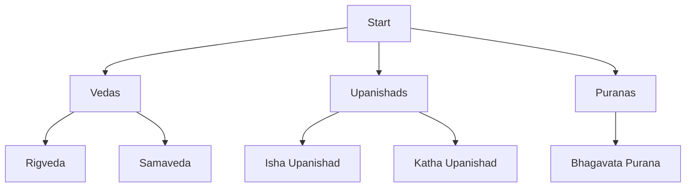

---
tags:
  - DailyNotes
aliases:
  - VEDAS
  - PURANS
  - UPANISHADS
Category:
  - GenAI
  - PromptEngg
---
# 2025/04-April/2025-04-27-Sunday

---
Date: 2025-04-27
Time: 12:19
Related to: [[2025-04-18-Friday|VEDAS]] [[2025-04-19-Saturday|PURANS]] 
Source: 
Tags: #DailyNotes #VEDAS #PURANS #UPANISHADS 

---
..contd... [[2025-04-26-Saturday]] ...

# Content Extracts
## Gemini

Identify key websites that provide lists of these texts. Good starting points include:

- Vedic Heritage Portal ([https://vedicheritage.gov.in/](https://vedicheritage.gov.in/)) - Explore the site map and categories.  
- Sanskrit Documents ([https://sanskritdocuments.org/](https://sanskritdocuments.org/)) - Browse through the categories and main texts.  
- Wikipedia's "List of Hindu texts" ([https://en.wikipedia.org/wiki/List_of_Hindu_texts](https://en.wikipedia.org/wiki/List_of_Hindu_texts)).
- Temple Purohit's list of Upanishads ([https://www.templepurohit.com/upanishads-details-list-108-upanishads-classifications/](https://www.templepurohit.com/upanishads-details-list-108-upanishads-classifications/)).
- Vyasa Online's list of Puranas ([https://www.vyasaonline.com/maha-puranas/](https://www.vyasaonline.com/maha-puranas/)).

## Krutrim

### **Learning Integration Plan**

|New Tech|Application Area|
|---|---|
|**Rust**|High-performance text processing|
|**Go**|Concurrent web scrapers|
|**C++**|OCR optimization for ancient manuscripts|
|**MongoDB**|Store unstructured commentary data|
|**PostgreSQL**|Structured metadata management|
**Next Steps**:

1. Start with Python web scraping + SQLite for initial data collection
2. Gradually integrate Rust/Go for performance-critical components
3. Build classification system using spaCy NLP
4. Implement Neo4j connections for philosophical-scientific relationships

## Krutrim

References [[f5br38_20250427_125442]]

## GROK

Resources

- Text Sources: sacred-texts.com, vedicreserve.mum.edu, sanskritdocuments.org.
    
- Programming:
    
    - Python: Official documentation, Real Python tutorials.
        
    - GoLang: golang.org, “The Go Programming Language” book.
        
    - Rust: rust-lang.org, “The Rust Programming Language” book.
        
    - Databases: PostgreSQL docs, MongoDB University, Neo4j Sandbox.
        
- Study Texts: “The Upanishads” by Eknath Easwaran, “The Bhagavata Purana” by Bibek Debroy.

## DeepSeek

### **5. Version Control & Collaboration (Git + CI/CD)**

- **Open-Source Contributions**: Collaborate on GitHub projects like [GRETIL](http://gretil.sub.uni-goettingen.de/) (Sanskrit texts repository) or build tools for scholars.
    
- **Track Personal Notes**: Use Git to version-control your annotations/translations of verses.
    

---

### **6. Sanskrit Programming (Optional Challenge)**

- Explore [Sanskrit programming languages](https://en.wikipedia.org/wiki/Sanskrit_programming_languages) like "Shastric Sanskrit" (academic projects).

### **Steps**:

1. **Identify Sources**:
    
    - [Sacred Texts Archive](https://www.sacred-texts.com/hin/)
        
    - [GRETIL (Sanskrit Texts)](http://gretil.sub.uni-goettingen.de/)
        
    - [Vedic Heritage Portal](https://vedicheritage.gov.in/)
        
    - [Gita Supersite](https://www.gitasupersite.iitk.ac.in/)

## Web Search #discord

https://www.adhyeta.org.in/

