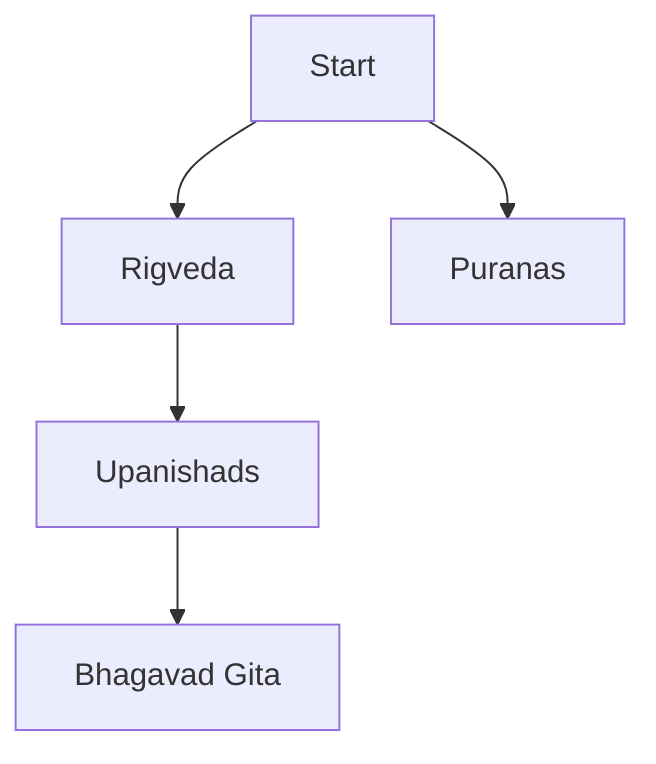

# Functional Specification Document (FSD)

## Document Information
**Document Title**: Code4Ved Functional Specification
**Version**: 1.0
**Date**: 2025-10-04
**Author**: Project Lead
**Reviewers**: Self-Review
**Status**: Draft

## Table of Contents
1. [Introduction](#introduction)
2. [System Overview](#system-overview)
3. [Functional Requirements](#functional-requirements)
4. [User Interface Specifications](#user-interface-specifications)
5. [Data Specifications](#data-specifications)
6. [Integration Requirements](#integration-requirements)
7. [Business Rules](#business-rules)

## Introduction

### Purpose
This document specifies the functional requirements for the Code4Ved platform, a comprehensive system for accessing, analyzing, and exploring Vedic literature through web scraping, database management, NLP analysis, and knowledge graph visualization.

### Scope
**In Scope:**
- Web scraping from 15+ Sanskrit text repositories
- Text extraction from PDF, HTML, and plain text formats
- Multi-dimensional classification system (language, format, category, concepts, themes)
- PostgreSQL relational database for structured metadata
- MongoDB for unstructured annotations and commentary
- Neo4j graph database for philosophical concept relationships
- NLP pipeline for keyword extraction, topic modeling, and concept identification
- Visualization tools for learning roadmaps and concept graphs

**Out of Scope:**
- Real-time translation engine (use existing translations)
- Mobile application
- User authentication system (single-user focus)
- Commercial features or monetization

### Audience
- Project developer/owner
- Future contributors to open-source repository
- Sanskrit studies community (as end users)

### Assumptions
- Text sources are publicly accessible or openly licensed
- Web scraping is permitted under ethical guidelines
- Development will be incremental with working prototypes
- Single-user local installation initially

## System Overview

### Business Context
Ancient Indian texts are scattered across multiple websites in various formats without unified access or classification. This system addresses the need for centralized, searchable, analytically-rich access to Vedic literature while providing a learning platform for modern programming technologies.

### System Objectives
1. Centralize access to 100+ texts from 10+ major repositories
2. Enable multi-dimensional classification and search
3. Provide NLP-based analysis revealing textual patterns
4. Visualize relationships between philosophical concepts and modern science
5. Create structured learning paths through complex literature
6. Develop reusable open-source tools for digital humanities

### High-Level Architecture
```
┌─────────────────────┐
│  Web Scrapers       │  ← Python/GoLang/Rust
│  (BeautifulSoup)    │
└──────────┬──────────┘
           │
           ▼
┌─────────────────────┐
│  Data Processing    │  ← PyPDF2, text cleaning
│  & Extraction       │
└──────────┬──────────┘
           │
           ▼
┌─────────────────────────────────────┐
│         Database Layer              │
│  ┌─────────┬─────────┬───────────┐ │
│  │PostgreSQL│ MongoDB │  Neo4j    │ │
│  │(metadata)│(comments)│ (graph)  │ │
│  └─────────┴─────────┴───────────┘ │
└──────────┬──────────────────────────┘
           │
           ▼
┌─────────────────────┐
│  NLP Pipeline       │  ← NLTK, spaCy
│  (Analysis)         │
└──────────┬──────────┘
           │
           ▼
┌─────────────────────┐
│  Visualization      │  ← Mermaid, NetworkX
│  & Query Interface  │
└─────────────────────┘
```

## Functional Requirements

### Feature 1: Web Scraping Module

#### FR1.1: Multi-Source Text Extraction
**Priority**: High
**Description**: System shall extract text content from 15+ identified Sanskrit repositories including vedicheritage.gov.in, gretil.sub.uni-goettingen.de, sanskritdocuments.org, sacred-texts.com, ambuda.org

**Acceptance Criteria**:
- [ ] Successfully scrape at least 10 different websites
- [ ] Handle HTML, PDF, and plain text formats
- [ ] Respect robots.txt and implement rate limiting
- [ ] Log all scraping activities with timestamps
- [ ] Store source URLs for attribution

**Business Rules**:
- Must comply with website terms of service
- Rate limit: max 1 request per second per site
- User-agent must identify project name and purpose

**Inputs**: Target URL, file format specification
**Outputs**: Raw text content, metadata (source, date, format)
**Pre-conditions**: Internet connectivity, valid URL
**Post-conditions**: Text stored in staging area with source attribution

#### FR1.2: PDF Text Extraction
**Priority**: High
**Description**: System shall extract text from PDF files using PyPDF2/pdfminer.six libraries

**Acceptance Criteria**:
- [ ] Extract text from standard PDF files
- [ ] Handle multi-page PDFs
- [ ] Preserve text structure where possible
- [ ] Log extraction errors for manual review
- [ ] Support OCR for scanned PDFs (future enhancement)

**Inputs**: PDF file path or URL
**Outputs**: Extracted text, page numbers, metadata
**Pre-conditions**: Valid PDF file accessible
**Post-conditions**: Text extracted and stored with page references

#### FR1.3: Ethical Scraping Controls
**Priority**: High
**Description**: System shall implement ethical web scraping practices

**Acceptance Criteria**:
- [ ] Read and respect robots.txt files
- [ ] Implement configurable rate limiting
- [ ] Provide clear user-agent identification
- [ ] Log all requests for audit trail
- [ ] Handle HTTP errors gracefully (429, 503)

**Business Rules**:
- Default rate: 1 request/second
- Retry on 503 with exponential backoff
- Abort on 403/401 and log for manual review

### Feature 2: Text Classification System

#### FR2.1: Multi-Dimensional Classification
**Priority**: High
**Description**: System shall classify each text across 5 dimensions: language, format, category, philosophical concepts, themes

**Acceptance Criteria**:
- [ ] Tag language: English, Hindi, Sanskrit
- [ ] Tag format: PDF, HTML, plain text
- [ ] Tag category: Vedas, Puranas, Upanishads, Samhitas, Epic Poems
- [ ] Extract philosophical concepts: Atman, Brahman, Karma, Dharma, Moksha, etc.
- [ ] Tag themes: spirituality, war, medicine, mathematics, duty, art, etc.

**Inputs**: Raw text content, metadata
**Outputs**: Classified text record with all dimension tags
**Pre-conditions**: Text extracted and preprocessed
**Post-conditions**: Text record stored in database with all classifications

#### FR2.2: Automated Concept Extraction
**Priority**: Medium
**Description**: System shall use NLP to automatically identify philosophical concepts in texts

**Acceptance Criteria**:
- [ ] Identify at least 20 core philosophical concepts
- [ ] Achieve >80% accuracy on manual validation sample
- [ ] Store concept occurrences with context (surrounding text)
- [ ] Support manual override/correction of automated tags

**Inputs**: Cleaned text content
**Outputs**: List of identified concepts with confidence scores
**Pre-conditions**: NLP models trained/configured
**Post-conditions**: Concepts stored in database with references

### Feature 3: Database Management

#### FR3.1: PostgreSQL Relational Database
**Priority**: High
**Description**: System shall maintain structured metadata in PostgreSQL database

**Acceptance Criteria**:
- [ ] Tables created for texts, concepts, themes, classifications
- [ ] Foreign key relationships properly defined
- [ ] Support full-text search on text content
- [ ] Indexes on frequently queried fields
- [ ] Support for complex queries across multiple dimensions

**Schema Requirements**:
```sql
-- Core tables
CREATE TABLE texts (
    id SERIAL PRIMARY KEY,
    title VARCHAR(500),
    language VARCHAR(50),
    format VARCHAR(50),
    category VARCHAR(100),
    source_url TEXT,
    extracted_date TIMESTAMP,
    content TEXT
);

CREATE TABLE philosophical_concepts (
    id SERIAL PRIMARY KEY,
    concept_name VARCHAR(200) UNIQUE,
    description TEXT,
    sanskrit_term VARCHAR(200)
);

CREATE TABLE themes (
    id SERIAL PRIMARY KEY,
    theme_name VARCHAR(200) UNIQUE,
    description TEXT
);

CREATE TABLE text_concepts (
    text_id INT REFERENCES texts(id),
    concept_id INT REFERENCES philosophical_concepts(id),
    context TEXT,
    confidence FLOAT,
    PRIMARY KEY (text_id, concept_id)
);

CREATE TABLE text_themes (
    text_id INT REFERENCES texts(id),
    theme_id INT REFERENCES themes(id),
    PRIMARY KEY (text_id, theme_id)
);
```

#### FR3.2: MongoDB for Unstructured Data
**Priority**: Medium
**Description**: System shall store commentary, annotations, and user notes in MongoDB

**Acceptance Criteria**:
- [ ] Store freeform annotations linked to text IDs
- [ ] Support nested document structure
- [ ] Enable text search within annotations
- [ ] Support tagging and categorization

**Document Structure**:
```json
{
  "text_id": "postgresql_text_id",
  "annotations": [
    {
      "date": "2025-01-01",
      "type": "commentary",
      "content": "Text of annotation",
      "tags": ["tag1", "tag2"]
    }
  ]
}
```

#### FR3.3: Neo4j Knowledge Graph
**Priority**: High
**Description**: System shall model relationships between concepts in Neo4j graph database

**Acceptance Criteria**:
- [ ] Nodes for philosophical concepts and scientific topics
- [ ] Edges for relationships (related_to, explains, contradicts)
- [ ] Support for graph traversal queries
- [ ] Visualization of concept networks
- [ ] >500 nodes and >1000 relationships

**Graph Model**:
```
(Concept:PhilosophicalConcept {name, description})
(Science:ScientificTopic {name, field})
(Concept)-[:RELATES_TO {strength, evidence}]->(Science)
(Concept)-[:EXPLAINED_IN]->(Text)
```

### Feature 4: NLP Analysis Pipeline

#### FR4.1: Keyword Extraction
**Priority**: High
**Description**: System shall extract significant keywords from each text using NLTK

**Acceptance Criteria**:
- [ ] Extract top 20 keywords per text
- [ ] Filter common stop words
- [ ] Calculate TF-IDF scores
- [ ] Store keywords with frequency counts

#### FR4.2: Topic Modeling
**Priority**: Medium
**Description**: System shall identify latent topics across text corpus using LDA

**Acceptance Criteria**:
- [ ] Identify 10-20 major topics
- [ ] Assign texts to primary topics
- [ ] Provide topic word distributions
- [ ] Visualize topic relationships

#### FR4.3: Concept Relationship Analysis
**Priority**: Medium
**Description**: System shall identify co-occurrence patterns between concepts

**Acceptance Criteria**:
- [ ] Calculate concept co-occurrence frequencies
- [ ] Identify strong concept pairs (co-occur >10 times)
- [ ] Store in graph database as relationships

### Feature 5: Visualization System

#### FR5.1: Learning Roadmap Generation
**Priority**: High
**Description**: System shall generate interactive learning roadmap following GitHub roadmap pattern

**Acceptance Criteria**:
- [ ] Mermaid diagram showing text progression
- [ ] Nodes for major text categories
- [ ] Edges showing recommended reading order
- [ ] Exportable as SVG/PNG

**Example Output**:


#### FR5.2: Concept Graph Visualization
**Priority**: Medium
**Description**: System shall visualize concept relationships using NetworkX

**Acceptance Criteria**:
- [ ] Interactive network graph
- [ ] Color-coded nodes by type
- [ ] Edge thickness by relationship strength
- [ ] Zoom and pan capabilities

## User Interface Specifications

### UI1: Command-Line Interface (Initial Version)
**Purpose**: Provide basic interaction with system functions
**User Types**: Developer/power user
**Navigation**: Terminal commands

**Commands**:
| Command | Description |
|---------|-------------|
| `c4v scrape <url>` | Scrape text from URL |
| `c4v classify <text_id>` | Classify extracted text |
| `c4v search <query>` | Search database |
| `c4v analyze <text_id>` | Run NLP analysis |
| `c4v graph concepts` | Generate concept graph |
| `c4v roadmap` | Display learning roadmap |

### UI2: Web Interface (Future Enhancement)
**Purpose**: User-friendly exploration of texts and visualizations
**User Types**: General users, students
**Navigation**: Web browser

**Pages** (Future):
- Search/Browse texts
- View text with annotations
- Explore concept graph
- View learning roadmap
- Analytical dashboards

## Data Specifications

### Data Quality Requirements
- Text accuracy: >95% for manual validation samples
- Classification accuracy: >80% for automated tags
- Source attribution: 100% of texts must have source URL
- Metadata completeness: All required fields populated

### Data Volume Estimates
- Texts: 100-500 documents
- Concepts: 100-200 unique concepts
- Themes: 20-50 unique themes
- Graph relationships: 1000-5000 edges

## Integration Requirements

### INT1: Database Integration
**Description**: Seamless integration between PostgreSQL, MongoDB, and Neo4j
**Requirements**:
- Shared text_id as primary key across systems
- Consistent data synchronization
- Transaction handling for multi-database updates

### INT2: External API Integration (Future)
**Description**: Potential integration with Sanskrit NLP APIs
**Requirements**:
- RESTful API consumption
- Error handling for external service failures
- Caching of API responses

## Business Rules

### BR1: Copyright and Licensing
- Only scrape texts from public domain or openly licensed sources
- Maintain source attribution for all texts
- Respect website terms of service

### BR2: Data Quality
- Manual validation required for automated classifications with confidence <80%
- Duplicate texts from different sources marked and linked

### BR3: Performance
- Scraping operations must respect rate limits
- Database queries should return results in <5 seconds
- Graph queries should complete in <10 seconds for typical traversals

### BR4: Scalability
- System designed to handle 500+ texts
- Database schema supports future expansion
- Modular architecture allows component upgrades
